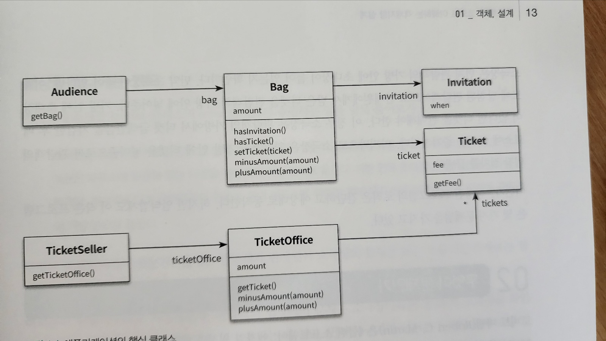
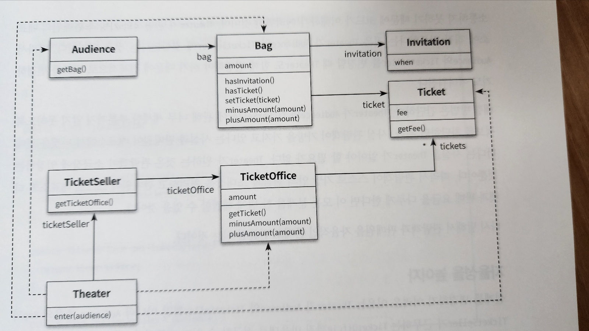
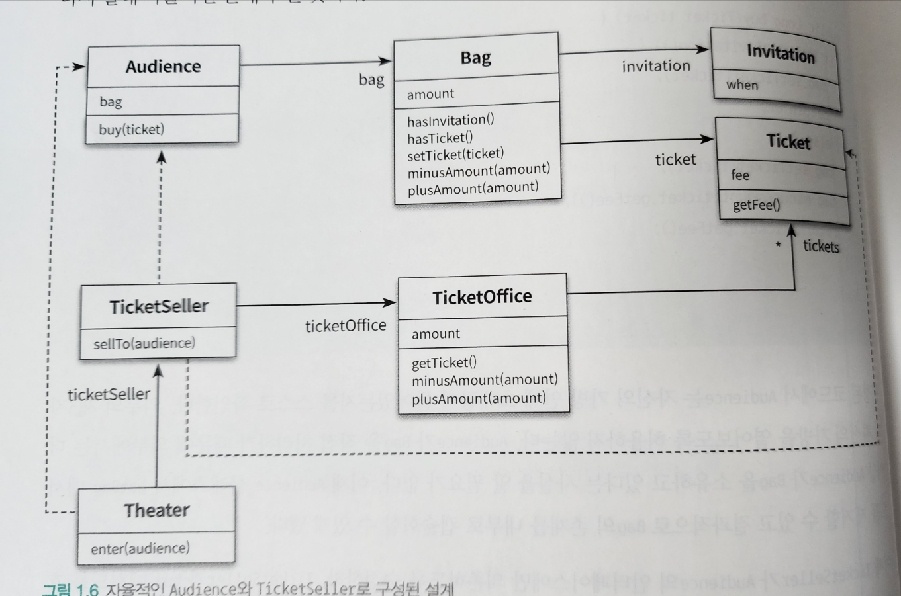
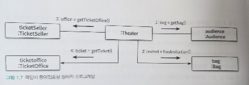
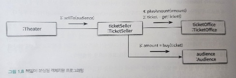
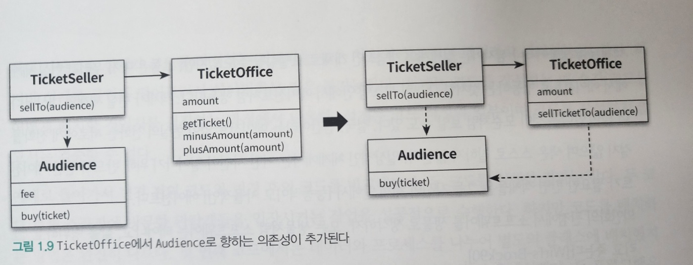

# 1장 객체, 설계

> 이론보다 실무가 먼저, 어떤 분야든 초기 단계에서는 아무것도 없는 상태에서 이론을 정립하기보다는 실무를 관찰한 결과를 바탕으로 이론을 정립하는 것이 최선이다.

- 소프트웨어 분야는 이론보다 실무가 더 앞서 있으며 실무가 더 중요하다.
- 실무가 이론보다 앞서 있는 대표적인 분야로 `소프트웨어 설계` 와 `소프트웨어 유지보수`가 있다
- 대부분의 설계 원칙과 개념 역시 실무에서 반복적으로 적용되던 기법들을 이론화한 것들이 대부분이다
- 실무에서는 다양한 규모의 소프트웨어를 성공적으로 유지보수하고 있지만, 소프트웨어 유지보수와 관련된 효과적인 이론이 발표된 적은 거의 없다.
- 심지어 이론은 소프트웨어 유지보수에 전혀 관심이 없는 것처럼 보이기까지 한다
- 결론적으로 소프트웨어 설계와 유지보수에 중점을 두려면 이론이 아닌 실무에 초점을 맞추는 것이 효과적이다
- 설계나 유지보수를 이야기할 때 이론을 중심에 두는 것은 적절하지 않다.
- 설계 분야에서는 실무가 이론을 압도한다.
- 설계에 관해 설명할 때 가장 유용한 도구는 이론으로 덕지덕지 치장한 개념과 용어가 아니라 '코드' 그 자체이다.
- 추상적인 개념과 이론은 훌륭한 코드를 작성하는데 필요한 도구일 뿐이다
- 프로그래밍을 통해 개념과 이론을 배우는 것이 개념과 이론을 통해 프로그래밍을 배우는 것보다 더 훌륭한 학습 방법이다.

## 01. 티켓 판매 애플리케이션 구현하기

- 이벤트에 당첨된 관람객과 그렇지 못한 관람객은 다른방식으로 입장시켜야 한다.
- 이벤트에 당첨된 관람객은 초대장을 티켓으로 교환한 후에 입장할 수 있다.
- 이벤트에 당첨되지 않은 관람객은 티켓을 구매해야만 입장할 수 있다.
- 관람객을 입장시키기 전에 이벤트 당첨 여부를 확인해야 하고 이벤트 담당자가 아닌 경우에는 티켓을 판매한 후에 입장시켜야 한다.

```java
/**
 * 초대장
 */
public class Invitation {
    private LocalDateTime when;
}
```

```java
/**
 * 공연 관람 티켓
 */
public class Ticket {
    private Long fee;
    
    public Long getFee() {
        return fee;
    }
}
```

```java
/**
 * 관람객이 소지한 소지품
 * 
 * 티켓과 현금, 초대장을 가질 수 있다.
 */
public class Bag {
    private Long amount;
    private Invitation invitation;
    private Ticket ticket;

    /**
     * 소지품에 현금만 있는 경우
     * 
     * @param amount
     */
    public Bag(long amount) {
        this(null, amount);
    }

    /**
     * 소지품에 초대장과 현금이 있는 경우
     * 
     * @param invitation
     * @param amount
     */
    public Bag(Invitation invitation, long amount) {
        this.invitation = invitation;
        this.amount = amount;
    }
    
    public boolean hasInvitation() {
        return invitation != null;
    }
    
    public boolean hasTicket() {
        return ticket != null;
    }
    
    public void setTicket(Ticket ticket) {
        this.ticket = ticket;
    }
    
    public void minusAmount(Long amount) {
        this.amount -= amount;
    }
    
    public void plusAmount(Long amount) {
        this.amount += amount;
    }
}
```

```java
/**
 * 관광객
 */
public class Audience {
    private Bag bag;
    
    public Audience(Bag bag) {
        this.bag = bag;
    }
    
    public Bag getBag() {
        return bag;
    }
}
```

```java
/**
 * 매표소
 * 
 * 티켓을 판매하거나 교환해줄 티켓의 
 * 목록과 금액을 포함
 */
public class TicketOffice {
    private Long amount;
    private List<Ticket> tickets = new ArrayList<>();
    
    public TicketOffice(Long amount, Ticket... tickets) {
        this.amount = amount;
        this.tickets.addAll(Arrays.asList(tickets));
    }

    /**
     * 첫번째 티켓
     * 
     * @return
     */
    public Ticket getTicket() {
        return tickets.remove(0);
    }
    
    public void minusAmount(Long amount) {
        this.amount -= amount;
    }
    
    public void plusAmount(Long amount) {
        this.amount += amount;
    }
}

```

```java
/**
 * 판매원
 * 
 * 일하는 매표소를 알고 있어야 한다.
 */
public class TicketSeller {
    private TicketOffice ticketOffice;
    
    public TicketSeller(TicketOffice ticketOffice) {
        this.ticketOffice = ticketOffice;
    }
    
    public TicketOffice getTicketOffice() {
        return ticketOffice;
    }
}

```



> 소극장을 구현하는 클래스는 Theater 이고, 관람객을 맞이할 수 있도록 enter 메서드를 구현한다.

```java
public class Theater {
    private TicketSeller ticketSeller;
    
    public Theater(TicketSeller ticketSeller) {
        this.ticketSeller = ticketSeller;
    }
    
    public void enter(Audience audience) {
        
        if (audience.getBag().hasInvitation()) {
            Ticket ticket = ticketSeller.getTicketOffice().getTicket();
            
            audience.getBag().setTicket(ticket);
        } else {
            Ticket ticket = ticketSeller.getTicketOffice().getTicket();
            audience.getBag().minusAmount(ticket.getFee());
            
            ticketSeller.getTicketOffice().plusAmount(ticket.getFee());
            audience.getBag().setTicket(ticket);
        }
    }
}

```

- 소극장은 관람객의 가방에 초대장이 있는지 확인한다
- 초대장이 있는경우 판매원에게서 받은 티켓을 가방에 넣는다
- 초대장이 없는 경우 티켓을 판매한다
  - 소극장은 관람객의 가방에서 티켓 금액만큼 차감한 후 매표소에 금액을 장가시킨다
  - 소극장은 관람객 가방 안에 티켓을 넣어준다.

> 예상대로 동작하지만, 몇 가지 문제점을 가지고 있다.

---

## 02. 무엇이 문제인가?

> 로버트 마틴은 소프트웨어 모듈이 가져야 하는 세 가지 기능에 관해 설명한다. 모듈이란 크기에 상관 없이 클래스나 패키지, 라이브러리와 같은 프로그램을 구성하는 임의의 요소를 말한다.

- 모든 소프트웨어 모듈에는 세가지 목적이 있다 
- 첫 번째 목적은 실행중에 제대로 동작하는 것
- 두 번째 목적은 변경을 위해 존자하는 것
  - 간단한 작업만으로도 변경이 가능해야 한다
  - 변경하기 어려운 모듈은 제대로 동작하더라도 개선해야 한다
- 세 번째 목적은 코드를 읽는 사람과 의사소통하는 것이다
  - 개발자가 쉽게 읽고 이해할 수 있어야 한다

---
- 모든 모듈은 제대로 실행돼야 하고
- 변경이 용이해야 하며
- 이해하기 쉬워야 한다

> 앞에서 작성한 프로그램은 관람객들을 입장시키는데 필요한 기능을 정확하게 수행하고 있다. 제대로 동작해야 한다는 제약은 만족하나, 변경 용이성과 읽는 사람과의 의사소통이라는 목적은 만족시키지 못한다.

---

### 예상을 빗나가는 코드

> 마지막에 소개한 Theader 클래스의 enter 메서드가 수행하는 일을 풀어보자

- 소극장은 관람객의 가방을 열어 그 안에 초대장이 들어 있는지 살펴본다.
- 초대장이 들어 있으면 판매원은 매표소에 보관돼 있는 티켓을 관람객의 가방 안으로 옮긴다.
- 초대장이 없다면 관람객의 가방에서 티켓 금액만큼의 현금을 꺼내 판매소에 적립한 후에 매표소에 보관돼 있는 티켓을 관람객의 가방 안으로 옮긴다.

> 무엇이 문제일까? 문제는 관람객과 판매원이 소극장의 통제를 받는 수동적인 존재라는 점이다.

- 관람객이라고 가정해보자
  - 소극장이라는 제 3자가 초대장을 확인하기 위해 관람객의 가방을 마음대로 열어 본다
- 판매원이라고 가정해보자
  - 소극장이 허락도 없이 매표소에 보관중이 티켓과 현금에 마음대로 접근할 수 있다
  - 티켓을 꺼내 관람객의 가방에 집어넣고 관람객에게 받은 돈을 매표소에 적립하는 일도 소극장이 수행한다

> 이해가능한 코드란 그 동작이 우리의 예상에서 크게 벗어나지 않는 코드다.

- 앞에서 살펴본 예제는 우리의 예상을 벗어난다
- 현실에서는 관람객이 직접 자신의 가방에서 초대장을 꺼내 판매원에게 건낸다.
- 티켓을 구매하는 관람객은 가방 안에서 돈을 직접 꺼내 판매원에게 지불한다.
- 판매원은 매표소에 있는 티켓을 직접 꺼내 관람객에게 건내고 관람객에게서 직접 돈을 받아 매표소에 보관한다.

> 코드를 이해하기 어렵게 만드는 또 다른 이유가 있다.

- 이 코드를 이해하기 위해서는 여러가지 세부적인 내용들을 한꺼번에 기억하고 있어야 한다.
- Theater의 enter 메서드를 이해하기 위해서는 
  - Audience가 Bag을 가지고 있고
  - Bag 안에는 현금과 티켓이 들어 있으며 TicketSeller가 TicketOffice 에서 티켓을 판매하고
  - TicketOffice 안에 돈과 티켓이 보관돼 있다는 모든 사실을 동시에 기억하고 있어야 한다.
- 이 코드는 하나의 클래스나 메서드에서 너무 많은 세부사항을 다루기 때문에 코드를 작성하는 사람뿐만 아니라 코드를 읽고 이해해야 하는 사람 모두에게 큰 부담을 준다.


### 변경에 취약한 코드

> 더 큰 문제는 변경에 취약하다는 것이다.

- 이 코드는 관람객이 현금과 초대장을 보관하기 위해 항상 가방을 들고 다닌다고 가정한다.
- 판매원이 매표소에서만 티켓을 판매한다고 가정한다.
  - 관람객이 가방을 들고 있지 않다면?
  - 관람객이 현금이 아닌 카드를 이용한다면?
  - 판매원이 매표소 밖에서 티켓을 판매해야 한다면?
  
> 관람객이 가방을 들고 있다는 가정이 바뀌었다고 가정해보자

- Audience 클래스에서 Bag을 제거해야 할 뿐만 아니라 Audience 의 Bag에 직접 접근하는 Theater 의 enter 메서드 역시 수정해야 한다.
  - Theater는 관람객이 가방을 들고 있고
  - 판매원이 매표소에서만 티켓을 판매한다는 지나치게 세부적인 사실에 의존해서 동작한다
- 세부적인 사실 중 한 가지라도 바뀌면 해당 클래스 뿐만 아니라 이 클래스에 의존하는 Theater 도 함께 변경해야 한다.
- 다른 클래스가 Audience 의 내부에 대해 더 많이 알면 알수록 Audience 를 변경하기 어려워진다.

> 이것은 객체 사이의 의존성 과 관련된 문제다

- 의존성은 변경과 관련돼 있다
- 의존성은 변경에 대한 영향을 암시한다
- 의존성이라는 말 속에는 어떤 객체가 변경될 때 그 객체에게 의존하는 다른 객체도 함께 변경될 수 있다는 사실이 내포되어 있따
- 객체사이의 의존성을 완전히 없애는 것이 정답은 아니다
- 객체지향 설계는 서로 의존하면서 협력하는 객체들의 공동체를 구축하는 것이다
- **우리의 목표는 애플리케이션의 기능을 구현하는데 필요한 최소한의 의존성만 유지하고 불필요한 의존성을 제거하는 것이다.**

> 객체 사이의 의존성이 과한 경우를 결합도가 높다고 말한다. 반대로 객체들이 합리적인 수준으로 의존할 경우에는 결합도가 낮다고 한다.

- 결합도는 의존성과 관련돼 있기 때문에 결합도 역시 변경과 관련이 있다
- 두 객체 사이의 결합도가 높으면 높을수록 함께 변경될 확률도 높아지기 때문에 변경하기 어려워진다.
- **설계의 목표는 객체 사이의 결합도를 낮춰 변경이 용이한 설계를 만드는 것이다**

> 너무 많은 클래스에 의존하는 Theater <br><br>
> 

---

## 03. 설계 개선하기

> 변경과 의사소통이라는 문제가 서로 엮여 있다

- 코드를 이해하기 어려운 이유는 Theater 가 관람객의 가방과 판매원의 매표소에 직접 접근하기 때문이다.
- 관람객과 판매원이 자신의 일을 스스로 처리해야 한다는 우리의 직관을 벗어난다.
- 의도를 정확하게 의사소통하지 못하기 때문에 코드가 이해하기 어려워진 것이다.
- Theater 가 관람객의 가방과 판매원의 매표소에 직접 접근한다는 것은 Theater 가 Audience 와 TicketSeller 에 결합된다는 것을 의미한다
- Audience 와 TicketSeeler 를 변경할 때 Theater 도 변경해야 하기 때문에 전체적으로 코드를 변경하기도 어려워진다

> 해결방안

- Theater 가 Audience 와 TicketSeller 에 관해 너무 세세한 부분까지 알지 못하도록 정보를 차단하면 된다.
- 관람객이 가방을 가지고 있다는 사실과, 판매원이 매표소에서 티켓을 판매한다는 사실을 Theater 가 알아야 할 필요가 없다
- Theater 가 원하는 것은 관람객이 소극장에 입장하는 것 뿐이다
- 관람객이 스스로 가방안의 현금과 초대장을 처리하고, 판매원이 스스로 매표소의 티켓과 판매 요금을 다루게 한다면 문제를 해결할 수 있다

### 자율성을 높이자 

- 설계를 변경하기 어려운 이유는 Theater 가 Audience 와 TicketSeller 뿐만 아니라 Audience 소유의 Bag 과 TicketSeller 가 근무하는 TicketOffice 까지 마음대로 접근할 수 있기 때문이다.
- 해결 방법은
  - Audience 와 TicketSeller 가 직접 Bag 과 TicketOffice 를 처리하는 자율적인 존재가 되도록 설계를 변경하는 것이다

> 첫 번째 단계, Theater 의 enter 메서드에서 TicketOffice 에 접근하는 모든 코드를 TicketSeller 내부로 숨기는 것

```java
public class Theater {
    private TicketSeller ticketSeller;

    public Theater(TicketSeller ticketSeller) {
        this.ticketSeller = ticketSeller;
    }

    public void enter(Audience audience) {
        ticketSeller.sellTo(audience);
    }
}
```

```java
/**
 * 판매원
 *
 * 일하는 매표소를 알고 있어야 한다.
 */
public class TicketSeller {
    private TicketOffice ticketOffice;

    public TicketSeller(TicketOffice ticketOffice) {
        this.ticketOffice = ticketOffice;
    }
    
    public void sellTo(Audience audience) {
        if (audience.getBag().hasInvitation()) {
            Ticket ticket = ticketOffice.getTicket();

            audience.getBag().setTicket(ticket);
        } else {
            Ticket ticket = ticketOffice.getTicket();
            audience.getBag().minusAmount(ticket.getFee());

            ticketOffice.plusAmount(ticket.getFee());
            audience.getBag().setTicket(ticket);
        }
    }
}
```

> TicketSeller 에서 getTicketOffice 메서드가 제거 됐다는 사실에 주목하라

- 외부에서는 ticketOffice 에 직접 접근할 수 없다 (private)
- TicketSeller 는 ticketOffice 에서 티켓을 꺼내거나 판매 요금을 적립하는 일을 스스로 수행할 수밖에 없다

> 이처럼 개념적이나 물리적으로 객체 내부의 세부적인 사항을 감추는 것을 캡슐화 라고 부른다.

- 캡슐화의 목적은 변경하기 쉬운 객체를 만드는 것이다
- 캡슐화를 통해 객체 내부로의 접근을 제한하면 객체와 객체 사이의 결합도를 낮출 수 있고, 설계를 좀 더 쉽게 변경할 수 있게 된다

> 수정된 Theater 클래스 어디서도 ticketOffice 에 접근하지 않는다.

- Theater 는 ticketOffice 가 TicketSeller 내부에 존재하는 사실을 알지 못한다.
- Theater 는 단지 ticketSeller 가 sellTo 메시지를 이해하고 응답할 수 있다는 사실만 알고 있을 뿐이다.
- Theater 는 TicketSeller 의 `인터페이스`에만 의존한다
- TicketSeller 가 내부에 ticketOffice 인스턴스를 포함하고 있다는 사실은 `구현`의 영역에 속한다
- 객체를 인터페이스와 구현으로 나누고 인터페이스만을 공개하는 것은 `객체 사이의 결합도를 낮추고 변경하기 쉬운 코드를 작성할 수 있다`.
 
> Theater 의 결합도를 낮춘 설계 <br><br>
> 

---

> Audience 캡슐화

- TicketSeller 는 Audience 의 getBag 메서드를 호출해서 Audience 내부의 Bag 인스턴스에 직접 접근한다.
- Bag 인스턴스에 접근하는 객체가 Theater 에서 TicketSeller 로 바뀌었을 뿐 Audience 는 여전히 자율적인 존재가 아니다.
- TicketSeller 와 동일한 방법으로 Audience 의 캡슐화를 개선할 수 잇다
- Bag 에 접근하는 모든 로직을 Audience 내부로 감추기 위해 Audience buy 메서드를 추가하고 TicketSeller 의 sellTo 메서드에서 getBag 메서드에 접근하는 부분을 buy 메서드로 옮기자

```java
/**
 * 관광객
 */
public class Audience {
    private Bag bag;

    public Audience(Bag bag) {
        this.bag = bag;
    }

    public Long buy(Ticket ticket) {
        
        if (bag.hasInvitation()) {
            bag.setTicket(ticket);
            
            return 0L;
        } else {
            bag.setTicket(ticket);
            bag.minusAmount(ticket.getFee());
            
            return ticket.getFee();
        }
    }
}
```

```java
/**
 * 판매원
 *
 * 일하는 매표소를 알고 있어야 한다.
 */
public class TicketSeller {
    private TicketOffice ticketOffice;

    public TicketSeller(TicketOffice ticketOffice) {
        this.ticketOffice = ticketOffice;
    }

    public void sellTo(Audience audience) {
        Ticket ticket = ticketOffice.getTicket();
        Long amount = audience.buy(ticket);
        
        ticketOffice.plusAmount(amount);
    }
}

```

- TicketSeller 와 Audience 사이의 결합도가 낮아졌다.
- Audience 가 캡슐화 되었다
- Audience 와 TicketSeller 가 내부 구현을 외부에 노출하지 않고 스스로 책임지고 해결한다.

> 자율적인 Audience 와 TicketSeller 로 구성된 설계 <br><br>
> 

---

### 무엇이 개선됐는가

- 동작을 수행해야 하는 첫 번재 목적을 만족한다
- 수정된 Audience 와 TicketSeller 는 자신이 가지고 있는 소지품을 스스로 관리한다.
- 코드를 읽는 사람과의 의사소통이라는 관점에서 확실히 개선되었다.

> 더 중요한 점은 Audience 나 TicketSeller 의 내부 구현을 변경하더라도 Theater 를 함께 변경할 필요가 없다

- 수정된 코드는 변경 용이성 측면에서도 확실히 개선됐다고 말할 수 있다

---

### 어떻게 한 것인가

- 자기 자신의 문제를 스스로 해결하도록 코드를 변경
- 수정 전에는 Theater 가 Audience 와 TicketSeller 에 강하게 결합되어 있어서, Audience 와 TicketSeller 의 변경에 영향을 받을 수 밖에 없었다
- 수정 후에는 Theater 는 Audience 와 TicketSeller 내부에 직접 접근하지 않는다
- 객체의 자율성을 높이는 방향으로 설계를 개선했다.
- 그 결과, 이해하기 쉽고 유연한 설계를 얻을 수 있었다

---

### 캡슐화와 응집도

- 핵심은 객체 내부의 상태를 캡슐화하고 객체 간에 오직 메세지를 통해서만 상호작용하도록 만드는 것이다.
- Theater 는 TicketSeller 의 내부에 대해서는 전혀 알지 못한다.
- 단지, TicketSeller 가 sellTo 메시지를 이해하고 응답할 수 있다는 사실만 알고 있다.
- TicketSeller 역시 Audience 내부에 대해 알지 못한다.
- 단지, Audience 가 buy 메시지에 응답할 수 있고 원하는 결과를 반환할 것이라는 사실만 알고 있다.
- 밀접하게 연관된 작업만을 수행하고 연관성 없는 작업은 다른 객체에게 위임하는 객체를 가리켜 `응집도`가 높다고 말한다
- 자신의 데이터를 스스로 처리하는 자율적인 객체를 만들면 결합도를 낮추고 응집도를 높일 수 있다
- 응집도를 높이기 위해서는 객체 스스로 데이터를 책임져야 한다
- 객체는 자신의 데이터를 스스로 처리하는 자율적인 존재여야 한다
- 외부의 간섭을 최대한 배제하고 메시지를 통해서만 협력하는 자율적인 객체들의 공동체를 만드는 것이 훌륭한 객체지향 설계를 얻을 수 있는 지름길이다.

---

### 절차지향과 객체지향

- 수정하기 전의 코드에서는 Theater 의 enter 메서드 안에서 Audience 와 TicketSeller 로 부터 Bag 과 TicketOffice 를 가져와 관람객을 입장시키는 절차를 구현했다.
- Audience, TicketSeller, Bag, TicketOffice 는 관람객을 입장시키는데 필요한 정보를 제공하고
- 모든 처리는 Theater 의 enter 메서드안에 존재했다

> 이 관점에서 Theater 의 enter 메서드는 `프로세스`이며 Audience, TicketSeller, Bag, TicketOffice 는 `데이터`다. <br>
> 프로세스와 데이터를 별도의 모듈에 위치시키는 방식을 `절차적 프로그래밍` 이라고 부른다


- 수정하기전 위 그림은 절차적 프로그래밍 방식으로 작성된 코드의 전형적인 의존성 구조를 보여준다
- 프로세스를 담당하는 Theater 가 TicketSeller, TicketOffice, Audience, Bag 모두에 의존하고 있다
- 모든 처리가 하나의 클래스 안에 위치하고, 나머지 클래스는 단지 데이터의 역할만 수행한다

> 일반적으로 절차적 프로그래밍은 우리의 직관에 위배된다

- 절차적 프로그래밍의 세계에서는 관람객과 판매원이 수동적인 존재일 뿐이다
- 절차적 프로그래밍의 세상은 우리의 예상을 너무나도 쉽게 벗어나기 때문에 코드를 읽는 사람과 원활하게 의사소통하지 못한다.
- 더 큰 문제는 절차적 프로그래밍의 세상에서는 데이터의 변경으로 인한 영향을 지역적으로 고립시키기 어렵다
- 변경은 버그르 부르고 버그에 대한 두려움은 코드를 변경하기 어렵게 만든다
- 따라서 절차적 프로그래밍의 세상은 변경하기 어려운 코드를 양산하는 경향이 있다

---


> 데이터와 프로세스가 동일한 모듈 내부에 위치하도록 프로그래밍 하는 방식을 `객체지향 프로그래밍` 이라고 부른다.


- 수정 후의 코드는 데이터를 사용하는 프로세스가 데이터를 소유하고 있는 Audience 와 TicketSeller 내부로 옮겨졌다.
- 수정 후의 위 그림에서 Theater 는 오직 TicketSeller 에만 의존한다
- TicketSeller 입장에서 Audience 에 대한 의존성이 추가됐지만 적절한 트레이드오프의 결과로 볼 수 있다
- 의존성은 적절히 통제되고 있으며 하나의 변경으로 인한 여파가 여러 클래스로 전파되는 것을 효율적으로 억제한다

> 훌륭한 객체지향 설계의 핵심은 캡슐화를 이용해 의존성을 적절히 관리함으로써 객체 사이의 결합도를 낮추는 것이다.

- 객체지향이 절차지향에 비해 변경에 좀 더 유연하다고 말하는 이유이다.
- 객체지향 코드는 자신의 문제를 스스로 처리해야 한다는 우리의 예상을 만족시키기 때문에 이해가 쉽다
- 객체지향 코드는 객체 내부의 변경이 객체 외부에 파급되지 않도록 제어할 수 있기 떄문에 변경하기가 수월하다.

---

### 책임의 이동

> 두 방식 사이에 근본적인 차이를 만드는 것은 `책임의 이동`이다. '책임'을 기능을 가리키는 객체지향 세계의 용어로 생각해도 무방하다



- 위 그림은 절차적 프로그래밍 방식으로 작업 흐름이 주로 Theater 에 의해 제어된다는 사실을 알 수 있다.
- **책임이 Theater 에 집중되어 있다**



- 위 그림은 객체지향 프로그래밍 방식으로 제어 흐름이 각 객체에 적절하게 분산돼 있다.
- 하나의 기능을 완성하는데 필요한 책임이여러 객체에 걸쳐 분산돼 있다.

---

- 변경 전의 절차적 설계에서는 Theater 가 전체적인 작업을 처리했다
- 변경 후의 객체지향 설계에서는 각 객체가 자신이 맡은 일을 스스로 처리했다.
- Theater 에 몰려 있던 책임이 개별 객체로 이동했다.
- 이것을 `책임의 이동` 이 의미하는 것이다.
- 각 객체는 `자신을 스스로` 책임진다.
- 객체지향 애플리케이션은 스스로 책임을 수행하는 자율적인 객체들의 공동체를 구성함으로써 완성된다.
- 객체지향 프로그래밍을 흔히 데이터와 프로세스를 하나의 단위로 통합해 놓는 방시으로 표현하기도 한다.

---

- 객체지향 안에는 데이터와 프로세스를 하나의 객체 안으로 모으는 것 이상의 무엇이 있다. (책을 읽으면 배우게 된다)
- 핵심은 적절한 객체에 적절한 책임을 할당 하는 것이다
- 객체는 다른 객체와의 협력이라는 문맥 안에서 특정한 역할을 수행하는 데 필요한 적절한 책임을 수행해야 한다
- 객체가 어떤 데이터를 가지느냐 보다는 객체에 어떤 책임을 할당할 것이냐에 초점을 맞춰야 한다

---

> 설계를 어렵게 만드는 것은 `의존성` 이라는 것을 기억하라

- 해결 방법은 불필요한 의존성을 제거함으로써 객체 사이의 결합도를 낮추는 것이다
- 예제에서는 캡슐화를 하여 결합도를 낮췄다.
- 캡슐화 하는 것은 객체의 자율성을 높이고 응집도 높은 객체들의 공동체를 창조할 수 있게 한다.
- 불필요한 세부사항을 캡슐화한 자율적인 객체들이 낮은 결합도와 높은 응집도를 가지고 협력하도록 최소한의 의존성만 남기는 것이 훌륭한 객체지향 설계다.

---

### 더 개선할 수 있다

```java
/**
 * 관광객
 */
public class Audience {
  private Bag bag;

  public Audience(Bag bag) {
    this.bag = bag;
  }

  public Long buy(Ticket ticket) {

    if (bag.hasInvitation()) {
      bag.setTicket(ticket);

      return 0L;
    } else {
      bag.setTicket(ticket);
      bag.minusAmount(ticket.getFee());

      return ticket.getFee();
    }
  }
}

```

- Audience 는 자율적인 존재다
- 하지만 Bag 은 Audience 에 끌려다니는 수동적인 존재다
- Bag 내부 상태에 접근하는 모든 로직을 Bag 안으로 캡슐화해서 결합도를 낮추면 된다
- Bag 내부에 hold 메서드를 추가한다

```java
/**
 * 관람객이 소지한 소지품
 *
 * 티켓과 현금, 초대장을 가질 수 있다.
 */
public class Bag {
    private Long amount;
    private Invitation invitation;
    private Ticket ticket;

    /**
     * 소지품에 현금만 있는 경우
     *
     * @param amount
     */
    public Bag(long amount) {
        this(null, amount);
    }

    /**
     * 소지품에 초대장과 현금이 있는 경우
     *
     * @param invitation
     * @param amount
     */
    public Bag(Invitation invitation, long amount) {
        this.invitation = invitation;
        this.amount = amount;
    }
    
    public Long hold(Ticket ticket) {
        setTicket(ticket);
        
        if (hasInvitation()) {
            return 0L;
        } else {
            minusAmount(ticket.getFee());
            
            return ticket.getFee();
        }
    }

    private boolean hasInvitation() {
        return invitation != null;
    }

    private boolean hasTicket() {
        return ticket != null;
    }

    private void setTicket(Ticket ticket) {
        this.ticket = ticket;
    }

    private void minusAmount(Long amount) {
        this.amount -= amount;
    }

    private void plusAmount(Long amount) {
        this.amount += amount;
    }
}
```

```java
/**
 * 관광객
 */
public class Audience {
    private Bag bag;

    public Audience(Bag bag) {
        this.bag = bag;
    }

    public Long buy(Ticket ticket) {
        return bag.hold(ticket);
    }
}
```

- hasInvitation, hasTicket, setTicket, munusAmount, plusAmount 는 더이상 외부에서 사용되지 않고, 내부에서만 사용되기 때문에 private 로 변경하였다.
- 이런 작은 메서드들을 제거하지 않고 그대로 유지한 이유는 코드의 중복을 제거하고 표현력을 높이기 위해서이다

---

- TicketSeller 역시 TicketOffice 의 자율권을 침해한다.
- TicketSeller 는 TicketOffice 에 있는 Ticket 을 마음대로 꺼내서는 자기 멋대로 팔고, 받은 돈을 마음대로 TicketOffice 에 넣어버린다.
- TicketOffice 의 자율권을 찾아주기 위해 TicketOffice 에 sellTicketTo 메서드를 추가한다

```java
/**
 * 매표소
 *
 * 티켓을 판매하거나 교환해줄 티켓의
 * 목록과 금액을 포함
 */
public class TicketOffice {
    private Long amount;
    private List<Ticket> tickets = new ArrayList<>();

    public TicketOffice(Long amount, Ticket... tickets) {
        this.amount = amount;
        this.tickets.addAll(Arrays.asList(tickets));
    }
    
    public void sellTicketTo(Audience audience) {
        Ticket ticket = getTicket();
        Long buyAmount = audience.buy(ticket);

        plusAmount(buyAmount);
    }

    /**
     * 첫번째 티켓
     *
     * @return
     */
    private Ticket getTicket() {
        return tickets.remove(0);
    }

    private void minusAmount(Long amount) {
        this.amount -= amount;
    }

    private void plusAmount(Long amount) {
        this.amount += amount;
    }
}
```

```java
/**
 * 판매원
 *
 * 일하는 매표소를 알고 있어야 한다.
 */
public class TicketSeller {
    private TicketOffice ticketOffice;

    public TicketSeller(TicketOffice ticketOffice) {
        this.ticketOffice = ticketOffice;
    }

    public void sellTo(Audience audience) {
        ticketOffice.sellTicketTo(audience);
    }
}
```

- TicketOffice 의 getTicket, minusAmount, plusAmount 는 내부에서만 사용하기 때문에 private 으로 변경한다

---

> 변경 후 TicketOffice 와 Audience 사이에 의존성이 추가 됐다

- 변경 전에는 존재하지 않았던 새로운 의존성이 추가 되엇다
- 의존성의 추가는 높은 결합도를 의미하고
- 높은 결합도는 변경하기 어려운 설계를 의미한다
- TicketOffice 의 자율성은 높였지만 전체 관점에서는 결합도가 상승했다

> TicketOffice 에서 Audience 로 향하는 의존성이 추가 됐다 <br><br>
>  

- Audience 에 대한 결합도와 TicketOffice 의 자율성 모두를 만족하는 방법이 떠오르지 않는다
- 이런 시점을 `트레이드오프`시점이라 부른다
- 어떤것을 우선해야 하는가?
  - 이 부분은 개발팀의 토론으로 결정한다 (정답은 없다)
  - 책에서는 Audience 의 결합도를 낮추는 것이 더 중요하다는 결론에 도달했다고 나와있다.

---

> 예시를 통해 알게된 점

1. 어떤 기능을 설계하는 방법은 한가지 이상일 수 있다
2. 동일한 기능을 한 가지 이상의 방법으로 설계할 수 있기 때문에 결국 설계는 트레이드오프의 산물이다
3. 어떤 경우에도 모든 사람들을 만족시킬 수 있는 설계를 만들 수는 없다
4. 설계는 균형의 예술이다
5. 훌륭한 설계는 적절한 트레이드오프의 결과물이라는 사실을 명심해야 한다

---

### 그래, 거짓말이다 !

> 앞에서 실생활의 관람객과 판매자가 스스로 자신의 일을 처리하기 대문에 코드에서의 Audience 와 TicketSeller 역시 스스로 자신을 책임져야 했다고 말했던 것을 기억하는가?

- Theater, Bag, TicketOffice 는 실세계에서 자율적인 존재가 아니다
  - 소극장 관람객이 입장하기 위해서는 누군가가 문을 열고 허가를 해줘야 한다
  - 가방에서 돈을 꺼내는 것은 관람객이지 가방이 아니다
  - 판매원이 매표소에 없는데도 티켓이 저절로 관람객에게 전달되지는 않을 것이다
- 그럼에도 이들을 관람객이나 판매원과 같은 생물처럼 다뤘다.
- 무생물 역시 스스로 행동하고 자기 자신을 책임지는 자율적인 존재로 취급했다.


- 현실에서는 수동적인 존재라고 하더라도, 객체지향의 세계에서는 모든 것이 능동적이고 자율적인 존재로 바뀐다
- 능동적이고 자율적인 존재로 소프트웨어 객체를 설계하는 원칙을 가리켜 `의인화` 라고 부른다 (by 레베카 워프스브록)

> 훌륭한 객체지향 설계란? 소프트웨어를 구성하는 모든 객체들이 자율적으로 행동하는 설계

---

## 04. 객체지향 설계

### 설계가 왜 필요한가

> 설계의 정의는 `설계란 코드를 배치하는 것이다` 이다

- 어떤 사람들은 설계가 코드를 작성하는 것보다는 높은 차원의 창조적인 행위라고 생각한다
- 설계와 구조를 떨어트려서 이야기하는 것은 불가능하다
- 설계는 코드를 작성하는 매 순간 코드를 어떻게 배치할 것인지 결정하는 과정이다
- 설계는 코드 작성의 일부이며 코드를 작성하지 않고서는 검증할 수 없다

---

> 예제의 변경 전의 코드와 변경 후의 코드를 비교해보자

- 실행한 결과는 같다
- 코드를 배치하는 방법은 완전히 다르다
- 변경 전 코드는 데이터와 프로세스를 나누어 별도의 클래스에 배치했지만
- 변경 후 코드는 필요한 데이터를 보유한 클래스 안에 프로세스를 함께 배치했다

---

> 좋은 설계란 무엇인가?

- 프로그램은 두 가지 요구사항을 만족시켜야 한다.
  - 오늘 완성해야 하는 기능을 구현하는 코드를 짜야 한다
  - 내일 쉽게 변경할 수 있는 코드를 짜야 한다
- 좋은 설계란, `오늘 요구하는 기능을 온전히 수행하면서 내일의 변경을 매끄럽게 수용할 수 잇는 설계다.`
- 변경을 수용할 수 있는 설계가 중요한 이유는
  - 요구사항이 항상 변경된다
  - 코드를 변경할 때 버그가 추가될 가능성이 높다

---

### 객체지향 설계

> 우리가 진정으로 원하는 것은 변경에 유연하게 대응할 수 있는 코드다

- 객체지향 프로그래밍은 의존성을 효율적으로 통제할 수 있는 다양한 방법을 제공한다
- 그에 따라 요구사항 변경에 좀 더 수월하게 대응할 수 있는 가능성을 높여준다
- `변경 가능한 코드`란 `이해하기 쉬운 코드`다


- 객체지향 패러다임은 세상을 바라보는 방식대로 코드를 작성할 수 있게 돕는다
- 객체는 자신의 데이터를 스스로 책임지는 자율적인 존재다.
- 객체지향은, 세상에 대해 예상하는 방식대로 객체가 행동하는 것을 보장하여 더 쉽게 이해할 수 있게 한다


- 객체지향의 세계에서 애플리케이션은 객체들로 구성되며 애플리케이션의 기능은 객체들 간의 상호작용을 통해 구현된다.
- 객체들 사이의 상호작용은 객체 사이에 주고 받는 메시지로 표현된다.
- 기능을 구현하기 위해 객체들이 협력하는 과정 속에서 객체들은 다른 객체에 의존하게 된다
- 메시지를 전송하기 위한 이런 지식이 두 객체를 결합시키고 이 결합이 객체 사이의 의존성을 만든다

> 훌륭한 객체지향 설계란, 객체 사이의 의존성을 적절하게 관리하는 설계다

- 객체간의 의존성은 애플리케이션을 수정하기 어렵게 만드는 주범이다
- 데이터와 프로세스를 하나의 덩어리로 모으는 것은 훌륭한 객체지향 설계로 가는 첫걸음이다.
- `진정한 객체지향 설계로 나아가는 것`은, **협력하는 객체들 사이의 의존성을 적절하게 조절함으로써 변경이 용이한 설계를 만드는 것이다.**
