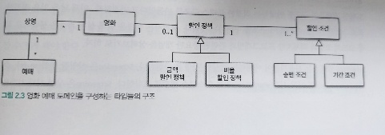
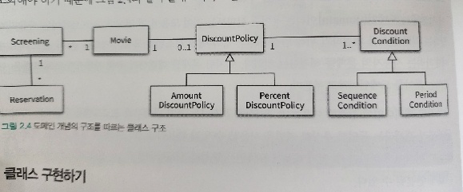
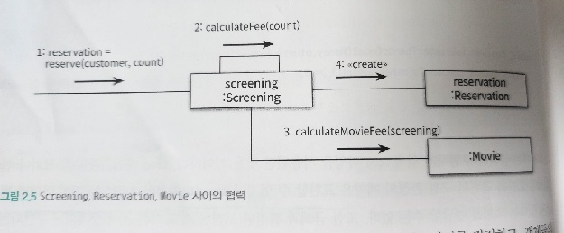
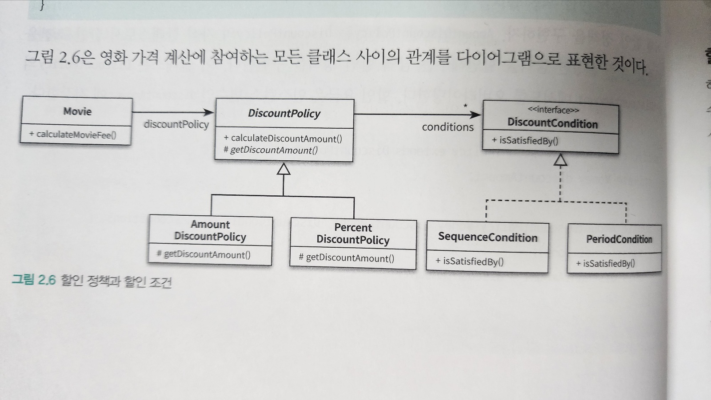
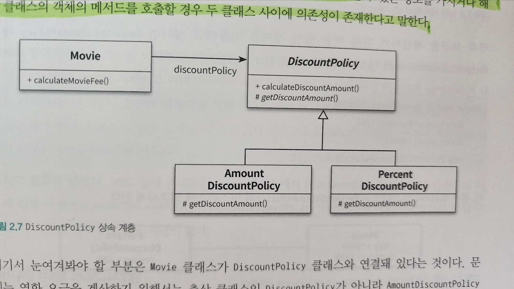
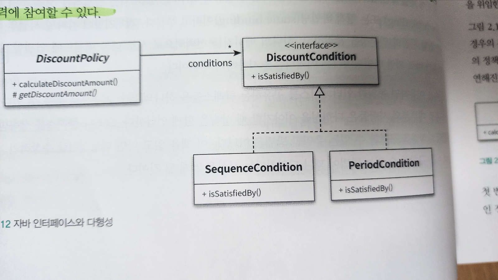
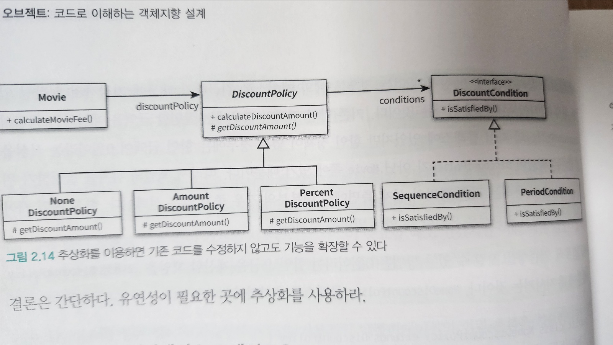
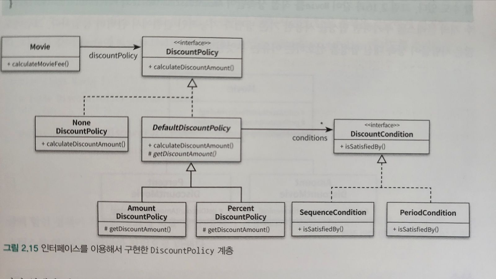

# 2장 객체지향 프로그래밍

## 01. 영화 예매 시스템

- 영화가 가지고 있는 기본적인 정보를 영화라는 단어로 사용
- 상영은 실제로 영화를 관람하는 시간을 표현
- 사용자가 실제로 예매하는 대상은 영화가 아닌 상영
- 사람들은 영화를 예매한다고 표현하지만, 실제로는 특정 시간에 상영되는 영화를 관람할 수 있는 권리를 구매

> 조건

- 특정한 조건을 만족하는 예매자는 요금을 할인받을 ㅅ ㅜ있다
- 할인액을 결정하는 두가지 규칙이 있다
  - 할인조건 할인정책
- 할인 조건은 가격의 할인 여부를 결정한다
  - 순서조건과 기간조건의 종류가 있다
- 순서조건은 상영순번을 이용해 할인 여부를 결정하는 규칙이다
- 기간조건은 영화상영 시작 시간을 이용해 할인 여부를 결정
- 할인정책은 할인 요금을 결정한다
  - 금액할인정책과 비율할인정책이 있다
- 영화별로 하나의 할인 정책만 할당할 수 있다.
- 예매 정보에는 제목, 상영정보, 인원, 정가 결제금액이 포함된다

## 02. 객체지향 프로그래밍을 향해

### 협력, 객체, 클래스

> 객체지향은 객체를 지향하는 것이다

- 객체지향 언어에 익숙한 사람이라면 가장 먼저 어떤 클래스가 필요한지 고민할 것이다
- 안타깝게도 이것은 객체지향 본질과는 거리가 멀다
- 객체지향은 말 그대로 객체를 지향하는 것이다
- 진정한 객체지향 패러다임으로의 전환은 클래스가 아닌 객체에 초점을 맞출 때에만 얻을 수 있다

#### 첫째, 어떤 클래스가 필요한지를 고민하기 전에 어떤 객체들이 필요한지 고민하라

- 클래스는 공통적인 사앹와 행동을 공유하는 객체들을 추상화한 것이다
- 클래스의 윤곽을 잡기 위해서는 어떤 객체들이 어떤 상태와 행동을 가지는지를 먼저 결정해야 한다
- 객체를 중심에 두는 접근 방법은 설계를 단순하고 깔끔하게 만든다

#### 둘째 객체를 독립적인 존재가 아니라 기능을 구현하기 위해 협력하는 공동체의 일원으로 봐야 한다

- 객체를 협력하는 공동체의 일원으로 바라보는 것은 설계를 유연하고 확장 가능하게 만든다
- 객체 지향적으로 생각하고 ㅅ깊다면 객체를 고립된 존재로 바라보지 말고 협력에 참여하는 협렵자로 바라봐야 한다
- 객체들의 모양과 윤곽이 잡히면 공통된 특성과 상태를 가진 객체들을 타입으로 분류하고 이 타입을 기반으로 클래스를 구현한다

### 도메인의 구조를 따르는 프로그램 구조

> 문제를 해결학 ㅣ위해 사용자가 프로그램을 사용하는 분야를 도메인 이라고 부른다

- 객체지향 패러다임이 강력한 이유는 요구사항을 분석하는 초기 단계부터 프로그램을 구현하는 마지막 단계까지 객체라는 동일한 추상화 기법을 사용할 수 있기 때문이다
- 도메인을 구성하는 개념들이 프로그램의 객체와 클래스로 매끄럽게 연결될 수 있다.
- 일반적으로 클래스의 이름은 대응되는 도메인 개념의 이름과 동일하거나 적어도 유사하게 지어야 한다
- 클래스 사이의 관계도 최대한 도메인 개념사이에 맺어진 관계와 유사하게 만들어서 프로그램 구조를 이해하고 예상하기 쉽게 만들어야 한다.


 


### 클래스 구현하기

```java
public class Screening {
    private Movie movie;
    private int sequence;
    private LocalDateTime whenScreened;
    
    public Screening(Movie movie, int sequence, LocalDateTime whenScreened) {
        this.movie = movie;
        this.sequence = sequence;
        this.whenScreened = whenScreened;
    }
    
    public LocalDateTime getStartTime() {
        return whenScreened;
    }

    public boolean isSequence(int sequence) {
        return this.sequence == sequence;
    }

    public Money getMovieFee() {
        return movie.getFee();
    }
}
```

- 인스턴스 변수의 가시성은 private 이고 메서드의 가시성은 public 이다
- 클래스를 구현하거나 다른 개발자에 의해 개발된 클래스를 사용할 때 가장 중요한 것은 클래스의 경계를 구분짓는 것
- 클래스는 내부와 외부로 구분되며 
- 훌륭한 클래스를 설계하기 위한 핵심은 어떤 부분을 외부에 공개하고 어떤 부분을 감출지를 결정하는 것

#### 클래스의 내부와 외부를 구분해야 하는 이유는 무엇일까?

- 경계의 명확성이 객체의 자율성을 보장한다
- 프로그래머에게 구현의 자유를 제공

### 자율적인 객체

- 첫 번째 사실은 객체 상태가 행동을 함께 가지는 복합적인 존재
- 두 번째 사실은 객체가 스스로 판단하고 행동하는 자율적인 존재


- 객체지향 이전의 패러다임에서는 데이터와 기능이라는 독립적인 존재를 서로 엮어 프로그램을 구성했따
- 객체지향은 객체라는 단어 안에 데이터와 기능을 한 덩어리로 묶음으로써 문제 영역의 아이디어를 적절하게 표현할 수 있게 했다
- 데이터와 기능을 객체 내부로 함께 묶는 것을 캡슐화 라고 부른다
- 객체지향 프로그래밍 언어들은 사앹와 행동을 캡슐화하는 것에서 한 걸음 더 나아가 외부에서의 접근을 통제할 수 있는 접근제어 메커니즘도 함께 제공한다
  - public, protected, private 등과 같은 접근 수정자


- 객체 내부에 대한 접근을 통제하는 이유는 객체를 자율 적인 존재를 만들기 위함이다
- 객체지향의 핵심은 스스로 상태를 관리하고 판단하고 행동하는 자율적인 객체들의 공동체를 구성하는 것


- 캡슐화와 접근제어는 외부에서 접근 가능한 부분을 퍼블릭 인터페이스 라고 부른다
- 외부에서 접근 불가능하고 오직 내부에서만 접근 가능한 부분을 구현이라고 부른다
- 인터페이스와 구현의 분리 원칙은 훌륭한 객체지향 프로그램을 하기 위해 따라야 하는 핵심 원칙이다


- 객체의 상태는 숨기고 행동만 외부에 공개
- 클래스의 속성은 private 으로 감추고 외부에 제공해야 하는 일부 메서드만 public 으로 선언한다
- 메서드들이 서비클래스나 내부에서만 접근 가능해야 한다면 가시성을 protected, private 로 지정한다
- 퍼블릭 인터페이스에는 public 으로 지정된 메서드만 포함된다
- 그 밖의 private 메서드나 protected 메서드, 속성은 구현에 포함된다


### 프로그래머의 자유

> 프로그래머의 역할을 클래스 작성자, 클라이언트 프로그래머 로 구분 짓는 것이 유용하다

- 클래스 작성자는 새로운 데이터 타입을 프로그램에 추가한다
- 클라이언트 프로그래머는 클래스 작성자가 추가한 데이터 타입을 사용한다
- 클라이언트 프로그래머의 목표는 필요한 클래스들을 엮어서 애플리케이션을 빠르고 안정적으로 구축하는 것이다
- 클래스 작성자는 클라이언트 프로그래머에게 필요한 부분만 공개하고 나머지는 꽁꽁 숨겨야 한다
- 클라이언트 프로그래머가 숨겨 놓은 부분에 마음대로 접근할 수 없도록 방지함으로써 클라이언트 프로그래머에 대한 영향을 걱정하지 않고도 내부 구현을 마음대로 변경할 수 있다
- 이를 구현 은닉 이라고 한다


- 접근제어 메커니즘은 프로그래밍 언어 차원에서 클래스 내부와 외부를 명확하게 경계 지을 수 있게 하는 동시에 클래스 작성자가 내부 구현을 은닉할 수 있게 해준다
- 구현은닉은 클라이언트 프로그래머는 내부의 구현은 뭇기한 채 인터페이스만 알고 있어도 클래스를 사용할 수 있기 때문에 머릿속에 담아둬야 하는 지식의 양을 줄일 수 있다
- 클래스 작성자는 인터페이스를 바꾸지 않는 한 외부에 미치는 영향을 걱정하지 않고도 내부 구현을 마음대로 변경할 수 있다


- 객체의 외부와 내부를 구분하면 클라이언트 프로그래머가 알아야할 지식의 양이 줄어들고
- 클래스 작성자가 자유롭게 구현을 변경할 수 있는 폭이 넓어진다
- 클래스를 개발할 때마다 인터페이스와 구현을 깔끔하게 분리하기 위해 노력해야 한다


- 설계가 필요한 이유는 변경을 관리 하기 위해서이다
- 객체지향 언어는 객체 사이의 의존성을 적절히 관리함으로써 변경에 대한 파급효과를 제어할 수 있는 다양한 방법을 제공한다
- 객체의 변경을 관리할 수 있는 기법 중에서 대표적인 것이 접근제어 이다


### 협력하는 객체들의 공동체

```java
public class Screening {
    private Movie movie;
    private int sequence;
    private LocalDateTime whenScreened;

    public Screening(Movie movie, int sequence, LocalDateTime whenScreened) {
        this.movie = movie;
        this.sequence = sequence;
        this.whenScreened = whenScreened;
    }

    public LocalDateTime getStartTime() {
        return whenScreened;
    }

    public boolean isSequence(int sequence) {
        return this.sequence == sequence;
    }

    public Money getMovieFee() {
        return movie.getFee();
    }
    
    public Reservation reserve(Customer customer, int audienceCount) {
        return new Reservation(customer, this, calculateFee(audienceCount), audienceCount);
    }
    
    private Money calculateFee(int audienceCount) {
        return movie.calculateMovieFee(this).times(audienceCount);
    }
}

```

```java
public class Money {

    public static final  Money ZERO = Money.wons(0);

    private final BigDecimal amount;

    public static Money wons(long amount) {
        return new Money(BigDecimal.valueOf(amount));
    }

    public static Money wons(double amount) {
        return new Money(BigDecimal.valueOf(amount));
    }

    Money(BigDecimal amount) {
        this.amount = amount;
    }
    
    public Money plus(Money amount) {
        return new Money(this.amount.add(amount.amount));
    }
    
    public Money minus(Money amount) {
        return new Money(this.amount.subtract(amount.amount));
    }
    
    public Money times(double percent) {
        return new Money(this.amount.multiply(BigDecimal.valueOf(percent)));
    }
    
    public boolean isLessThan(Money other) {
         return amount.compareTo(other.amount) < 0;
    }
    
    public boolean isGreaterThanOrEqual(Money other) {
        return amount.compareTo(other.amount) >= 0;
    }
}
```

- 1장에서는 금액을 구현하기 위해 Long 타입을 사용했다
- Long 타입은 변수의 크기나 연산자의 종류와 관련된 구현 관점의 제약은 표현할 수 있지만
- Money 타입처럼 지정하는 값이 금액과 관련돼 있다는 의미를 전달할 수 는 없고, 금액과 관련된 로직이 서로 다른 곳에 중복되어 구현되는 것을 막을 수 없다
- 의미를 좀 더 명시적이고 분명하게 표현할 수 있다면 객체를 사용해서 해당 개념을 구현해야 한다
- 개념이 비록 하나으 ㅣ인스턴스 변수만 포함하더라도 개념을 명시적으로 표현하는 것은 전체적인 설계의 명확성과 유연성을 높이는 첫걸음이다

```java
public class Reservation {
    
    private Customer customer;
    private Screening screening;
    private Money fee;
    private int audienceCount;
    
    public Reservation(Customer customer, Screening screening, Money fee, int audienceCount) {
        this.customer = customer;
        this.screening = screening;
        this.fee = fee;
        this.audienceCount = audienceCount;
    }
}
```

- 영화를 예매하기 위해 Screening, Movie, Reservation 인스턴스들은 서로의 메서드를 호출하며 상호 작용한다.
- 어떤 기능을 구현하기 위해 객체들 사이에 이뤄지는 상호작용을 협력 이라고 부른다.



### 협력에 관한 이야기 

- 객체는 다른 객체의 인스턴스에 공개된 행동을 수행하도록 요청할 수 있다
- 요청을 받은 객체는 자율적인방법에 따라 요청을 처리한 후 응답한다
- 객체가 다른 객체와 상효작용할 수 있는 유일한 방법은 메시지를 전송 하는 것 뿐이다
- 다른 객체에게 요청이 도착할 ㄸ ㅐ해당 객체가 메시지를 수신 했다고 한다
- 수신된 메시지를 처리하기 위한 자신만의 방법을 메서드 라고 부른다
- 메시지와 메서드의 구분에서부터 다형성의 개념이 출발한다
- Screening 이 Movie 의 calucationMovieFee 메서드를 호출한다고 말했지만 사실은 Screening이 Moive 에게 calculationMovieFee 메시지를 전송한다 라고 말하는 것이 적절한 표현이다.
- 메시지를 수신한 Movie 는 스스로 적절한 메서드를 선택한다
- 메시지를 처리하는 방법을 결정하는 것은 Movie 스스로의 문제인 것이다.
- 이것이 객체가 메시지를 처리하는 방법을 자율적으로 결정할 수 있다고 말했던 이유이다.

## 03. 할인 요금 구하기

### 할인 요금 계산을 위한 협력 시작하기

```java
public class Movie {
    
    private String title;
    private Duration runningTime;
    private Money fee;
    private DiscountPolicy discountPolicy;

    public Movie(String title, Duration runningTime, Money fee, DiscountPolicy discountPolicy) {
        this.title = title;
        this.runningTime = runningTime;
        this.fee = fee;
        this.discountPolicy = discountPolicy;
    }
    
    public Money getFee() {
        return fee;
    }
    
    public Money calculateMovieFee(Screening screening) {
        return fee.minus(discountPolicy.calculationDiscountAmount(screening));
    }
}

```

- calcuateMovieFee 메서드는 discountPolicy 에 calculateDiscountAmount 메시지를 전송해 할인 요금을 반환받는다
- Movie 는 기본 요금인 fee 에서 반환된 요금을 차감한다
- 어떤 할인 정책을 사용할 것인지 결정하는 코드가 어디에도 존재하지 않는다
- 코드 어디에도 할인 정책을 판단하는 코드가 없고, 단지 discountPolicy 에게 메시지를 전송할 뿐이다.
- 객체 지향엣 ㅓ중요하다고 여겨지는 두 가지 개념이 숨겨져 있다.
  - 상속, 다형석
  - 그 기반에는 추상화 라는 원리가 숨겨져 있다.

### 할인 정책과 할인 조건

- 할인 정책은 금액 할인 정책과 비율 할인 정책으로 구분된다
- 두 가지 할인 정책을 각각 AmountDiscountPolicy, PercentDiscountPolicy 라는 클래스로 구현할 것이다
- 두 클래스 대부분의 코드가 유사하고 할인 요금을 계산하는 방식만 조금 다르다
- 클래스 사이의 중복 코드를 제거하기 위해 공통 코드를 보관할 장소가 필요하다
- 부모 클래스인 DiscountPolicy 안에 중복 코드를 두고 AmountDiscountPolicy 와 PercentDiscountPolicy 가 이 클래스를 상속받게 할 것이다
- DiscountPolicy 의 인스턴스를 생성할 필요가 없기 때문에 추상 클래스로 구현한다.


```java
public abstract class DiscountPolicy {
    
    private List<DiscountCondition> conditions = new ArrayList<>();

    public DiscountPolicy(DiscountCondition... conditions) {
        this.conditions = Arrays.asList(conditions);
    }
    
    public Money calculationDiscountAmount(Screening screening) {
        for (DiscountCondition each : conditions) {
            if (each.isSatisfiedBy(screening)) {
                return getDiscountAmount(screening);
            }
        }
        
        return Money.ZERO;
    }
    
    abstract protected Money getDiscountAmount(Screening screening);
}
```

- DiscountPolicy 는 할인 여부와 요금 계산에 필요한 전체적인 흐름은 정의하지만, 실제로 요금을 계산하는 부분은 추상 메서드인 getDiscountAmount 메서드에 위임한다.
- 부모클래스에 기본적인 알고리즘의 흐름을 구현하고 중간에 필요한 처리를 자식 클래스에게 위임하는 디자인 패턴츨 `TEMPLATE METHOD `패턴 이라고 부른다.

```java
public interface DiscountCondition {
    boolean isSatisfiedBy(Screening screening);
}

```

- 할인 조건에는 순번 조건과 기간 조건이 있다.

```java
public class SequenceCondition implements DiscountCondition {

    private int sequence;

    public SequenceCondition(int sequence) {
        this.sequence = sequence;
    }

    @Override
    public boolean isSatisfiedBy(Screening screening) {
        return screening.isSequence(sequence);
    }
}
```

```java
public class PeriodCondition implements DiscountCondition {

    private DayOfWeek dayOfWeek;
    private LocalTime startTime;
    private LocalTime endTime;

    public PeriodCondition(DayOfWeek dayOfWeek, LocalTime startTime, LocalTime endTime) {
        this.dayOfWeek = dayOfWeek;
        this.startTime = startTime;
        this.endTime = endTime;
    }

    @Override
    public boolean isSatisfiedBy(Screening screening) {
        return screening.getStartTime().getDayOfWeek().equals(dayOfWeek) &&
                startTime.compareTo(screening.getStartTime().toLocalTime()) <= 0 &&
                endTime.compareTo(screening.getStartTime().toLocalTime()) >= 0;
    }
}
```

- AmountDiscountPolicy 는 DiscountPolicy 의 자식 클래스로서 할인 조건을 만족할 경우 일정한 금액을 할인해주는 금액 할인 정책을 구현한다.

```java
public class AmountDiscountPolicy extends DiscountPolicy {

    private Money discountAmount;
    
    public AmountDiscountPolicy(Money discountAmount, DiscountCondition... conditions) {
        super(conditions);
        this.discountAmount = discountAmount;
    }

    @Override
    protected Money getDiscountAmount(Screening screening) {
        return discountAmount;
    }
}
```

- PercentDiscountPolicy 역시 DiscountPolicy 의 자식 클래스로서 구현한다.

```java
public class PercentDiscountPolicy extends DiscountPolicy {
    private double percent;

    public PercentDiscountPolicy(double percent, DiscountCondition... conditions) {
        super(conditions);
        this.percent = percent;
    }

    @Override
    protected Money getDiscountAmount(Screening screening) {
        return screening.getMovieFee().times(percent);
    }
}

```




### 할인 정책 구성하기

- 하나의 영화에 단 하나의 할인 정책만 설정할 수 있다
- 하나의 영화에 할인 조건은 여러개를 적용할 수 있다
- Movie 의 생성자는 오직 하나의 하링ㄴ 정책을 받도록 선언되어있다.
- DiscountPolicy 의 생성자는 여러개의 DiscountCondition 인스턴스를 허용한다.

> 이처럼 생성자의 파라미터 목록을 이용해 초기화에 필요한 정보를 전달하도록 강제하면 올바른 상태를 가진 객체의 생성을 보장할 수 있다.


## 04. 상속과 다형성

### 컴파일 시간 의존성과 실행 시간 의존성



- Movie 는 DiscountPolicy 와 연결되어 있으며 AmountDiscountPolicy 와 PercentDiscountPolicy 는 추상 클래스인 DiscountPolicy 를 상속받는다
- 이처럼 어떤 클래스가 다른 클래스에 접근할 수 있는 경로를 가지거나 해당 클래스의 객체의 메서드를 호출할 경우 두 클래스 사이에 의존성이 존재한다고 말한다.


- 눈여겨봐야 할 부분은 Movie 클래스가 DiscountPolicy 클래스와 연결되어 있다는 것이다
- 영화 요금을 계산하기 위해서는 추상클래스인 DiscountPolicy 가 아니라 AmountDiscountPolicy, PercentDiscountPolicy 인스턴스가 필요하다.
- 따라서 Movie 의 인스턴스는 실행시에 AmountDiscountPolicy, PercentDiscountPolicy 에 의존해야 한다.
- 하지만, 코드 수준에서 Movie 클래스는 이 두 클래스 중 어느 것에도 의존하지 않는다.
- 오직 추상 클래스인 DiscountPolicy 에만 의존한다
- Movie의 생성자에서 DiscountPolicy 타입의 객체를 인자로 전달받고 있다.

```java
// 실행시 AmountDiscountPolicy 에 의존
Movie avatar = new Moive("아바타" Duration.ofMinutes(120), Money.wons(10000), new AmountDiscountPolicy(Money.wons(800), ...));

// 실행시 PercentDiscountPolicy 에 의존
Movie avatar = new Moive("아바타" Duration.ofMinutes(120), Money.wons(10000), new PercentDiscountPolicy(0.1, ...));
```

- 코드상에서 Movie 는 DiscountPolicy 에 의존하나
- 실행 시점에는 Movice 인스턴스는 AmountDiscountPolicy 나 PercentDiscountPolicy 의 인스턴스에 의존한다

> 코드의 의존성과 실행 시점의 의존성이 서로 다를 수 있다

- 클래스 사이의 의존성과 객체 사이의 의존성은 동일하지 않을 수 있다
- 유연하고, 쉽게 재사용할 수 있으며, 확장 가능한 객체지향 설계가 가지는 특징은 코드의 의존성과 실행 시점의 의존성이 다르다는 것이다.

> 한 가지 간과해서는 안 되는 사실은, 코드의 의존성과 실행 시점의 의존성이 다르면 다를 수록 코드를 이해하기 어려워진다는 것이다.

- 코드를 이해하기 위해서는 코드뿐만 아니라 객체를 생성하고 연결하는 부분을 찾아야 하기 때문이다.
- 반면 코드의 의존성과 실행 시점의 의존성이 다르면 다를수록 코드는 더 유연해지고 확장 가능해진다.
- 이와 같은 의존성의 양면성은 설계가 트레이드 오프의 산물이라는 사실을 보여준다.

> 설계가 유연해질수록 코드를 이해하고 디버깅하기는 점점 더 어려워진다. 반면 유연성을 억제하면 코드를 이해하고 디버깅 하기는 쉬워지지만 재사용성과 확장 가능성은 낮아진다.

- 훌륭한 객체지향 설계자로 성장하기 위해서는 항상 유연성과 가독성 사이에서 고민해야 한다.
- 무조건 유연한 설계도, 무조건 읽기 쉬운 코드도 정답이 아니다.

### 차이에 의한 프로그래밍

- 클래스를 하나 추가하고 싶은데 그 클래스가 기존의 어떤 클래스와 매우 흡사하다고 가정해보자
  - 방법1) 클래스의 코드를 가져와 약간만 추가하거나 수정해서 새로운 클래스 생성
  - 방법2) 더 좋은 방법은 클래스의 코드를 수정하지 않고 재사용하는 방법이다.
- 이를 가능하게 해주는 방법이 바로 상속이다.

> 상속은 객체지향에서 코드를 재사용하기 위해 가장 널리 사용되는 방법이다.

- 상속을 이용하면 클래스 사이에 관계를 설정하는 것만으로 기존 클래스가 가지고 있는 모든 속성과 행동을 새로운 클래스에 포함시킬 수 있다.
- DiscountPolicy 에 정의된 모든 속성과 메서드를 그대로 물려받는 AmountDiscountPolicy 와 PercentDiscountPolicy 클래스는 상속의 강력함을 잘 보여주는 예시이다.
- 상속은 기존 클래스를 기반으로 새로운 클래스를 쉽고 빠르게 추가할 수 있는 간편한 방법을 제공한다
- 상속을 이용하면 부모 클래스의 구현은 공유하면서도 행동이 다른 자식 클래스를 쉽게 추가할 수 있다
- AmountDiscountPolicy 와 PercentDiscountPolicy 의 경우 DiscountPolicy 에서 정의한 추상 메서드인 getDiscountAmount 메서드를 오버라이딩 해서 DiscountPolicy 의 행동을 수정한다.
- 부모 클래스와 다른 부분만을 추가해서 새로운 클래스를 쉽고 빠르게 만드는 방법을 `차이에 의한 프로그래밍` 이라고 부른다

### 상속과 인터페이스

> 상속이 가치 있는 이유는 부모 클래스가 제공하는 모든 인터페이스를 자식 클래스가 물려받을 수 있기 때문이다.

- 이것은 상속을 바라보는 일반적인 인식과는 거리가 있다.
- 대부분의 사람들은 상속의 목적이 메서드나 인스턴스 변수를 재사용 하는 것이라고 생각하기 때문이다.

> 인터페이스는 객체가 이해할 수 있는 메시지의 목록을 정의한다.

- 상속을 통해 자식 클래스는 자신의 인터페이스에 부모 클래스의 인터페이스를 포함하게 된다.
- 결과적으로 자식 클래스는 부모 클래스가 수신할 수 있는 모든 메시지를 수신할 수 있기 때문에 외부 객체는 자식 클래스를 부모 클래스와 동일한 타입으로 간주할 수 있다.

```java
public class Movie {
    public Money calculateMovieFee(Screening screening) {
        return fee.minus(discountPolicy.calculateDiscountAmount(screening));
    }   
}
```

- Movie 가 DiscountPolicy 의 인터페이스에 정의된 calculateDiscountAmount 메시지를 전송하고 있다.
- DiscountPolicy 를 상속받는 AmountDiscountPolicy, PercentDiscountPolicy 의 인터페이스에도 이 오퍼레이션이 포함되어 있다.
- Movie 입장에서는 자신과 협력하는 객체가 어떤 클래스의 인스턴스인지 중요한 것이 아니라
- calculateDiscountAmount 메시지를 수신할 수 있다는 사실이 중요하다.
- 다시 말해, Movie 는 협력 객체가 calculateDiscountAmount 라는 메시지를 이해할 수만 있다면 그 객체가 어떤 클래스의 인스턴스인지는 상관하지 않는다.

> 자식 클래스는 상속을 통해 부모 클래스의 인터페이스를 물려받기 때문에 부모 클래스 대신 사용될 수 있다.

- 컴파일러는 코드 상에서 부모 클래스가 나오는 모든 장소에서 자식 클래스를 사용하는 것을 허용한다.
- Movie 의 생성자에서 인자의 타입이 DiscountPolicy 임에도 AmountDiscountPolicy, PercentDiscountPolicy 의 인스턴스를 전달할 수 있는 이유가 바로 이 때문이다.
- 또한 DiscountPolicy 타입인 Movie 의 인스턴스 변수인 discountPolicy 에 인자로 전달된 AmountDiscountPolicy, PercentDiscountPolicy 의 인스턴스를 할당할 수 있는 이유도 이 때문이다.

> 이처럼 자식 클래스가 부모 클래스를 대신하는 것을 `업캐스팅` 이라고 부른다

### 다형성

> 메시지와 메서드는 다른 개념이다

- Movie 는 DiscountPolicy 의 인스턴스에게 calculateDiscountAmount 메시지를 전송한다
- 그렇다면 실행되는 메서드는 무엇인가 ? 
- Movie 와 상호작용하기 위해 연결된 객체의 클래스가 무엇인가에 따라 달라진다.
- Movie 와 협력하는 객체가 AmountDiscountPolicy 의 인스턴스라면 AmountDiscountPolicy 에서 오버라이딩한 메서드가 실행될 것이다
- Movie 와 협력하는 객체가 PercentDiscountPolicy 의 인스턴스라면 PercentDiscountPolicy 에서 오버라이딩한 메서드가 실행될 것이다
- 코드 상에서 Movie 클래스는 DiscountPolicy 클래스에게 메시지를 전송하지만 
- 실행 시점에서 실제로 실행되는 Movie 와 합력하는 객체의 실제 클래스가 무엇인지에 따라 달라진다.

> Movie 는 동일한 메시지를 전송하지만 실제로 어떤 메서드가 실행될 것인지는 메시지를 수신하는 객체의 클래스가 무엇이냐에 따라 달라진다. 이를 `다형성` 이라고 부른다

- 다형성은 객체지향 프로그램의 컴파일 시간 의존성과 실행 시간 의존성이 다를 수 있다는 사실을 기반한다.
- 프로그램을 작성할 때 Movie 클래스는 추상 클래스인 DiscountPolicy 에 의존한다.
- 컴파일 시간 의존성은 Movie 에서 DiscountPolicy 로 향한다
- 실행 시간 의존성은 Movie 에서 AmountDiscountPolicy, PercentDiscountPolicy 로 향한다
- 다형성은 컴파일 시간 의존성과 실행 시간 의존성을 다르게 만들 수 있는 객체지향 특성을 이용해 서로 다른 메서드를 실행할 수 있게 한다.

> 다형성이란 동일한 메시지를 수신했을 때 객체의 타입에 따라 다르게 응답할 수 있는 능력을 의미한다.

- 다형적인 협력에 참여하는 객체들은 모두 같은 메시지를 이해할 수 있어야 한다
- 다시 말해, 인터페이스가 동일해야 한다.
- 다형성은 메시지에 응답하기 위해 실행될 메서드를 컴파일 시점이 아닌 실행 시점에 결정한다.
- 메시지와 메서드를 실행 시점에 바인딩 한다.
- 이를 `지연 바인딩` 또는 `동적 바인딩` 이라고 부른다
- 전통적인 함수 호출처럼 컴파일 시점에 함수나 프로시저를 결정하는 것을 `초기 바인딩` 또는 `정적 바인딩` 이라고 부른다.
- 객체지향이 컴파일 시점의 의존성과 실행 시점의 의존성을 분리하고, 하나의 메시지를 선택적으로 서로 다른 메서드에 연결할 수 있는 이유가 지연 바인딩을 사용하기 때문이다.

> 클래스를 상속 받는 것만이 다형성을 구현할 수 있는 유일한 방법은 아니다. ps) 이 책을 읽고 나면 다형성이란 추상적인 개념이며 이를 구현할 수 있는 방법이 꽤나 다양하다는 사실을 알게될 것이다. by. 조영호)


#### 구현 상속과 인터페이스 상속

- 구현 상속
  - 서브 클래싱 이라고 부른다.
  - 순수하게 코드를 재사용 하기 위한 목적
- 인터페이스 상속
  - 서브타이핑 이라고 부른다.
  - 다형적인 협력을 위해 부모 클래스와 자식 클래스가 인터페이스를 공유할 수 있도록 상속을 이용하는 것
- 상속은 구현 상속이 아닌 인터페이스 상속을 위해 사용해야 한다.
- 대부분의 사람들은 코드 재사용을 상속의 주요 목적이라고 생각하지만 오해다.
- 인터페이스를 재사용할 목적이 아니라 구현을 재사용할 목적으로 상속을 사용하면 변경에 취약한 코드를 낳게 된다.

### 인터페이스와 다형성

- 앞에서는 DiscountPolicy 를 추상클래스로 구현함으로써 자식 클래스들이 인터페이스와 내부 구현을 함께 상속 받도록 만들었다.
- 종종 구현은 공유할 필요가 없고 순수하게 인터페이스만 공유할 경우가 있다.
- 이를 위해 자바에서는 인터페이스라는 요소를 제공한다.
- 인터페이스는 말 그대로 구현에 대한 고려 없이 다형적인 협력에 참여하는 클래스들이 공유 가능한 외부 인터페이스를 정의한 것이다.


- 추상 클래스를 이용해 다형성을 구현했던 할인 정책과 달리
- 할인 조건은 구현을 공유할 필요가 없기 때문에, 인터페이스를 이용해 타입 계층을 구현했다.
- DiscountCondition 인터페이스를 실체화 하고 있는 SequenceCondition 과 PeriodCondition 은 동일한 인터페이스를 공유하며 다형적인 협력에 참여할 수 있다.



- SequenceCondition 과 PeriodCondition 은 isSatisfiedBy 메시지를 이해할 수 있기 때문에 클라이언트인 DiscountPolicy 입장에서 이 둘은 DiscountCondition 과 아무 차이도 없다.
- DiscountCondition 을 실체화 하는 클래스들은 동일한 인터페이스를 공유하며 DiscountCondition 을 대신해서 사용할 수 있다.
- 이 경우에도 업캐스팅이 적용되며 협력은 다형적이다.


## 05. 추상화와 유연성

### 추상화의 힘

- 할인 정책은 구체적인 금액 할인 정책과 비율 할인 정책을 포괄하는 추상적인 개념이다
- 할인 조건 역시 더 구체적인 순번 조건과 기간 조건을 포괄하는 추상적인 개념이다
- DiscountPolicy 는 AmountDiscountPolicy, PercentDiscountPolicy 보다 추상적이고
- DiscountCondition 은 SequenceCondition, PeriodCondtion 보다 추상적이다
- 프로그래밍 언어 측면에서 DiscountPolicy 와 discountCondition 이 더 추상적인 이유는 인터페이스에 초점을 맞추기 때문이다.

> 추상화를 할 경우 두 가지 장점

1. 추상화의 계층만 따로 떼어놓고 살펴보면 요구사항의 정책을 높은 수준에서 서술할 수 있다.
2. 추상화를 이용하면 실체가 좀 더 유연해 진다.

- 첫번째 장점
  - 예시를 하나의 문장으로 정리하면, "영화 예매 요금은 최대 하나의 '할인 정책' 과 다수의 '할인 조건' 을 이용해 계산할 수 있다" 로 표현할 수 있다.
  - 이 문장이, "영화의 예매 요금은 '금액 할인 정책' 과 '두 개의 순서 조건, 한 개의 기간 조건' 을 이용해서 계산할 수 있다" 라는 문장을 포괄할 수 있다는 사실이 중요하다.
  - 추상화를 사용하면 세부적인 내용을 무시한 채 상위 정책을 쉽고 간단하게 표현할 수 있다.
  - 세부사항에 억눌리지 않고 상위 개념만으로도 도메인의 중요한 개념을 설명할 수 있게 한다.
  - 추상화를 이용한 설계는 필요에 따라 표현의 수준을 조정하는 것을 가능하게 해준다.
  - 추상화를 이용해 상위 정책을 기술한다는 것은 기본적인 애플리케이션의 협력 흐름을 기술한다는 것을 의미한다.
  - 할인 정책이나 할인 조건의 새로운 자식 클래스들은 추상화를 이용해서 정의한 상위의 협력 흐름을 그대로 따르게 된다.
  - 재사용 가능한 설계의 기본을 이루는 `디자인 패턴` 이나 프레임워크 모두 추상화를 이용해 상위 정책을 정의하는 객체지향의 메커니즘을 활용하고 있다
- 두번째 장점
  - 추상화를 이용해 상위 정책을 표현하면 기존 구조를 수정하지 않고도 새로운 기능을 쉽게 추가하고 확장할 수 있다.
  - 다시 말해 설계를 유연하게 만들 수 있다

### 유연한 설계

- 할인 정책이 없는 경우, 할인 요금을 계산할 필요 없이 영화에 설정된 기본 금액을 그대로 사용하면 된다.

```java
public class Movie {

    private String title;
    private Duration runningTime;
    private Money fee;
    private DiscountPolicy discountPolicy;

    public Movie(String title, Duration runningTime, Money fee, DiscountPolicy discountPolicy) {
        this.title = title;
        this.runningTime = runningTime;
        this.fee = fee;
        this.discountPolicy = discountPolicy;
    }

    public Money getFee() {
        return fee;
    }

    public Money calculateMovieFee(Screening screening) {
        
        if (discountPolicy == null) {
            return fee;
        }
        
        return fee.minus(discountPolicy.calculationDiscountAmount(screening));
    }
}

```

- 위 방식의 문제점은 할인정책이 없는 경우를 예외 케이스로 취급하기 때문에 지금까지 일관성 있던 협력 방식이 무너지게 된다.
- 기존 할인 정책의 경우에는 할인할 금액을 계산하는 책임이 DiscountPolicy 의 자식 클래스에 있었지만
- 할인 정책이 없는 경우에는 할인 금액이 0원이라는 사실을 결정하는 책임이 DiscountPolicy 가 아닌 Movie 에 있다.
- 책임의 위치를 결정하기 위해 조건문을 사용하는 것은 협력의 설계 측면에서 대부분의 경우 좋지 않은 선택이다.
- 항상 예외 케이스를 최소화 하고 일관성을 유지할 수 있는 방법을 선택하라
- 일관성을 지킬 수 있는 방법은 0원 이라는 할인 요금을 계산할 책임을 그대로 DiscountPolicy 계층에 유지시키는 것이다.
- NoneDiscountPolicy 를 추가한다.

```java
public class NoneDiscountPolicy extends DiscountPolicy {
    
    @Override
    protected Money getDiscountAmount(Screening screening) {
        return Money.ZERO;
    }
}
```

```java

// 할인 되지 않는 영화 생성
Movie starWars = new Movie("스타워즈", Duration.ofMinutes(210), Money.wons(10000), new NoneDiscountPolicy());
```

- 기존의 Movie 와 DiscountPolicy 를 수정하지 않고 NoneDiscountPolicy 라는 새로운 클래스를 추가하는 것만으로 기능을 확장했다.
- 추상화를 중심으로 코드의 구조를 설계하면 유연하고 확장 가능한 설계를 만들 수 있다.
- 추상화가 유연한 설계를 가능하게 하는 이유는 설계가 구체적인 상황에 결합되는 것을 방지하기 때문이다.
- DiscountPolicy 역시 특정한 할인 조건에 묶여있지 않다.
- DiscountCondition 을 상속받은 어떤 클래스와도 협력이 가능하다
- 이것은 DiscountPolicy 와 DiscountCondition 이 추상적이기 때문에 가능하다.
- 8장에서 컨텍스트 독립성 이라고 불리는 이 개념은 프레임워크와 같은 유연한 설계가 필수적인 분야에서 그 진가를 발휘한다.



### 추상 클래스와 인터페이스 트레이드 오프

- NoneDiscountPolicy 클래스의 코드를 자세히 보면 getDiscountAmount() 메서드가 어떤 값을 반환하더라도 상관이 없다는 사실을 알 수 있다.
- 부모 클래스인 DiscountPolicy 에서 할인 조건이 없을 경우에는 getDiscountAmount() 메서드를 호출하지 않기 때문이다.
- 이것은 부모 클래스인 DiscountPolicy 와 NoneDiscountPolicy 를 개념적으로 결합시킨다.
- NoneDiscountPolicy 의 개발자는 getDiscountAmount() 가 호출되지 않을 경우 DiscountPolicy 가 0원을 반환할 것이라는 사실을 가정하고 있다.
- 이 문제를 해결하는 방법은 DiscountPolicy 를 인터페이스로 바꾸고 NoneDiscountPolicy 가 DiscountPolicy 의 getDiscountAmount() 메서드가 아닌 calculateDiscountAmount() 오퍼레이션을 오버라이딩 하도록 변경하는 것이다.

```java
public interface DiscountPolicy {
    
    Money calculationDiscountAmount(Screening screening);
}

```

```java
public abstract class DefaultDiscountPolicy implements DiscountPolicy {

    private List<DiscountCondition> conditions = new ArrayList<>();

    public DefaultDiscountPolicy(DiscountCondition... conditions) {
        this.conditions = Arrays.asList(conditions);
    }

    public Money calculationDiscountAmount(Screening screening) {
        for (DiscountCondition each : conditions) {
            if (each.isSatisfiedBy(screening)) {
                return getDiscountAmount(screening);
            }
        }

        return Money.ZERO;
    }

    abstract protected Money getDiscountAmount(Screening screening);
}
```



- 이상적으로는 인터페이스를 사용하도록 변경한 설계가 더 좋을 것이다
- 현실적으로는 NoneDiscountPolicy 만을 위해 인터페이스를 추가하는 것이 과하다는 생각이들 수도 있을 것이다.
- 변경 전의 NoneDiscountPolicy 역시 할인 금액이 0원 이라는 사실을 효과적으로 전달하기 때문이다.


- 구현과 관련된 모든 것들이 트레이드오프의 대상이 될 수 있다
- 작성하는 모든 코드에는 합당한 이유가 있어야 한다
- 아주 사소한 결정이더라도 트레이드 오프를 통해 얻어진 결론과 그렇지 않은 결론 사이의 차이는 크다.

### 코드 재사용

- 상속은 코드를 재사용하기 위해 널리 사용되는 방법이다
- 객체지향 설계와 관련된 자료를 조금이라도 본 사람은 상속보다는 합성이 더 좋은 방법이라는 이야기를 많이 들었을 것이다.
- 합성이란 객체의 인스턴스를 자신의 인스턴스 변수로 포함해서 재사용 하는 방법을 말한다.
- Movie 가 DiscountPolicy 코드를 재사용 하는 방법이 합성이다.

### 상속

- 상속은 객체지향에서 코드를 재사용하기 위해 널리 사용되는 기법이다.
- 하지만 두 가지 관점에서 안좋은 영향을 미친다.
- 첫 번째 캡슐화를 위반한다
  - 상속을 이용하기 위해서는 부모 클래스의 구조를 알고 있어야 한다
  - 부모 클래스의 구현이 자식 클래스에게 노출되기 때문에 캡슐화가 약화된다
  - 캡슐화의 약화는 자식 클래스가 부모클래스에 강하게 결합되도록 만들기 때문에 부모 클래스를 변경할 때 자식 클래스도 변경될 확률을 높인다.
  - 상속을 과도하게 사용한 코드는 변경하기도 어려워진다
- 두 번째 설계가 유연하지 않다
  - 상속은 부모 클래스와 자식 클래스 사이의 관계를 컴파일 시점에 결정한다
  - 실행 시점에 객체의 종류를 변경하는 것이 불가능하다.

### 합성

- Movie 는 요금을 계산하기 위해 DiscountPolicy 의코드를 필드 변수로 재사용 한다.
- 이 방법이 상속과 다른 점은 상속이 부모 클래스의 코드와 자식 클래스의 코드를 컴파일 시점에 하나의 단위로 강하게 결합되는데 비해, Movie가 DiscountPolicy 의 인터페이스를 통해 약하게 결합된다는 점이다.
- 이처럼 인터페이스에 정의된 메시지를 통해서만 코드를 재사용 하는 방법을 `합성` 이라고 부른다
- 합성은 상속이 가지는 두 가지 문제점을 해결한다
  - 인터페이스에 정의된 메시지를 통해서만 재사용이 가능하기 때문에 구현을 효과적으로 캡슐화 할 수 있다
  - 의존하는 인스턴스를 교체하는 것이 비교적 쉽기 때문에, 유연한 설계를 가질 수 있다
  - 상속은 클래스를 통해 강하게 결합되는 데 비해 합성은 메시지를 통해 느슨하게 결합된다.
  - 코드 재사용을 위해서는 상속보다는 합성을 선호하는 것이 더 좋은 방법이다
- 하지만 대부분의 설계에서는 합성과 상속을 동시에 사용해야 한다.
- 코드를 재사용하는 경우에는 상속보다는 합성을 선호하는 것이 옳지만 
- 다형성을 위해 인터페이스를 재사용하는 경우에는 상속과 합성을 함께 조합해서 사용할 수 밖에 없다.