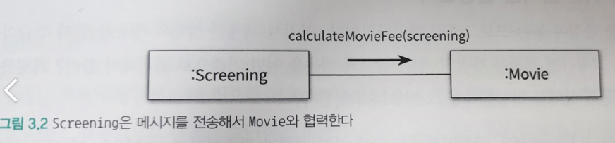

# 3장 역할, 책임, 협력

> 객체지향 패러다임의 관점에서 핵심은 역할, 책임, 협력 이다.

- 클래스, 상속, 지연 바인딩도 중요하지만 구현 측면에 치우쳐 있기 때문에 객체지향 패러다임의 본질과는 거리가 멀다.
- 객체지향의 본질은 협력하는 객체들의 공동체를 창조하는 것
- 객체지향 설계의 핵심은 적절한 객체를 찾고, 적절한 책임을 할당하는 과정
- 클래스와 상속은 객체들의 책임과 협력이 어느 정도 자리를 잡은 후에 사용할 수 있는 구현 메커니즘일 뿐
- 어떤 협력이 필요하고, 협력을 위해 어떤 역할과 책임이 필요한지를 고민하지 않은 채 너무 이른 시기에 구현에 초점을 맞추는 것은 변경하기 어렵고 유연하지 못한 코드를 낳는 원인이 된다.

---

## 1. 협력

### 영화 예매 시스템 돌아보기

- 애플리케이션의 제어 흐름은 어떤 하나의 객체에 의해 통제되지 않고 다양한 객체들 사이에 균형 있게 분배되는 것이 일반적이다.
- 다양한 객체들이 기능을 구현하기 위해 메시지를 주고 받으면서 상호 작용한다.
- 객체들이 애플리케이션의 기능을 구현하기 위해 수행하는 상호작용을 `협력` 이라고 한다.
- 객체가 협력에 참여하기 위해 수행하는 로직은 `책임` 이라고 부른다.
- 객체들이 협력안에서 수행하는 책임들이 모여 객체가 수행하는 `역할`을 구성한다.

---

### 협력

> 메세지 전송은 객체 사이의 협력을 위해 사용할 수 있는 유일한 커뮤니케이션 수단이다.

- `협력`이란 어떤 객체가 다른 객체에게 무엇인가를 요청하는 것
- 메시지를 수신한 객체는 메서드를 실행해 요청에 응답한다
- 객체가 메시지를 처리할 방법을 스스로 선택한다
- 외부의 객체는 오직 메시지만 전송할 수 있을 뿐이다
- 메시지를 어떻게 처리할지는 메시지를 수신한 객체가 직접 결정한다
- 즉, 객체가 자신의 일을 스스로 처리할 수 있는 자율적인 존재라는 것을 의미한다.

1. 요금을 계산하는 작업을 Screening 이 수행한다면 Movie의 인스턴스 변수인 fee 와 discountPolicy 에 직접 접근해야 한다.
2. 이 경우 Screening 은 Movie 의 내부 구현에 결합된다.
3. Movie 의 자율성이 훼손된다.

- 자율적인 객체란 자신의 상태를 직접 관리하고 스스로의 결정에 따라 행동하는 객체다.
- 객체의 자율성을 보장하기 위해서는 필요한 정보와 정보에 기반한 행동을 같은 객체안에 모아놓아야 한다.
- 객체를 자율적으로 만드는 가장 기본적인 방법은 내부 구현을 캡슐화 하는 것이다.
- 객체들 사이의 협력을 구성하는 일련의 요청과 응답의 흐름을 통해 애플리케이션의 기능이 구현된다.

---

### 협력이 설계를 위한 문맥을 결정한다

- 객체란 상태와 행동을 함께 캡슐화 하는 실행 단위이다.
- 객체가 가질 수 있는 상태와 행동을 어떤 기준으로 결정해야 할까?
- 객체를 설계할 때 어떤 행동과 상태를 할당했다면 그 이유는 무엇인가?

> 애플리케이션 안에 어떤 객체가 필요하다면 그 이유는 단 하나여야 한다.

- 그 객체가 어떤 협력에 참여하고 있기 때문이다.
- 객체가 협력에 참여할 수 있는 이유는 협력에 필요한 적절한 행동을 보유하고 있기 떄문이다.
- 객체의 행동을 결정하는 것은 객체가 참여하고 있는 협력이다.

---

- Movie 에 포함된 대부분의 메서드는 요금을 계산하는 행동과 관련되어있다.
- Movie 가 영화를 예매하기 위한 협력에 참여하고 있고
- 요금을 계산하는 책임을 지고 있다.
- Movie 의 행동을 결정하는 것은 영화 예매를 위한 협력이다.
- 협력이라는 문맥을 고려하지 않고 Movie 의 행동을 결정하는 것은 아무런 의미가 없다.
- 객체의 상태를 결정하는 것은 행동이다
- 객체의 상태는 그 객체가 행동을 수행하는데 필요한 정보가 무엇인지로 결정된다.
- 객체는 자신의 상태를 스스로 결정하고 관리하는 자율적인 존재이다
- 객체가 수행하는 행동에 필요한 상태도 함께 가지고 있어야 한다.

---

- 상태는 객체가 행동하는 데 필요한 정보에 의해 결정된다.
- 행동은 협력 안에서 객체가 처리할 메시지로 결정된다.
- 객체가 참여하는 협력이 객체를 구성하는 행동과 상태 모두를 결정한다.
- 협력은 객체를 설계하는데 필요한 일종의 문맥을 제공한다.

---

## 2. 책임

### 책임이란 무엇인가

> 협력에 참여하기 위해 객체가 수행하는 행동을 책임 이라고 부른다.

- 책임이란 응집도 있는 행위의 집합이다.
- 객체가 유지해야 하는 정보와 수행 할 수 있는 행동에 대해 개략적으로 서술한 문장이다.
- 객체의 책임은 '무엇을 알고 있는가' 와 '무엇을 할 수 있는가' 로 구성된다
- 책임을 크게 '하는 것' 과 '아는 것' 의 두 가지 범주로 나누어 세분화 할 수 있다.

~~~text
[하는 것]
- 객체를 생성하거나 계산을 수행하는 등의 스스로 하는 것
- 다른 객체의 행동을 시작시키는 것
- 다른 객체의 행동을 제어하고 조절하는 것

[아는 것]
- 사적인 정보에 관해 아는 것
- 관련된 객체에 관해 아는 것
- 자신이 유도하거나 계산할 수 있는 것에 관해 아는 것
~~~

---

- Screening
  - 책임 : 영화를 예매하는 것
  - 하는 것 : 영화를 예매할 수 있어야 한다
  - 아는 것 : 상영할 영화를 알고 있어야 한다
- Movie 
  - 책임 : 요금을 계산하는 것
  - 하는 것 : 가격을 계산할 수 있어야 한다
  - 아는 것 : 가격과 어떤 할인 정책이 적용 됐는지 알고 있어야 한다

---

- 책임과 메시지의 크기는 다르다.
- 책임은 객체가 수행할 수 있는 행동을 종합적이고 간략하게 서술한다
- 책임은 메시지보다 추상적이고 개념적으로도 더 크다
  - 단순한 책임이라고 생각했던 것이 여러 개의 메시지로 분할되기도 하고
  - 하나의 객체가 수행할 수 있다고 생각했던 책임이 나중에는 여러 객체들이 협력해야만 하는 커다란 책임으로 자라는 것이 일반적이다.

> 책임은 객체지향 설계의 핵심이다

- 객체지향 개발에서 가장 중요한 능력은 책임을 능숙하게 소프트웨어 객체에 할당하는 것이다
- 협력이 중요한 이유는 객체에 할당할 책임을 결정할 수 있는 문맥을 제공하기 때문이다.

---

### 책임 할당

- 자율적인 객체를 만드는 가장 기본적인 방법은 책임을 수행하는데 필요한 정보를 전문가에게 그 책임을 할당하는 것이다.
- 이를 책임 할당을 위한 `정보 전문가 패턴` 이라고 부른다.

> 영화 예매 시스템을 예로들어 정보 전문가에게 책임을 할당하는 방법을 살펴보자.

1. 시스템이 사용자에게 제공해야 할 기능은 영화를 예매하는 것
2. 이 기능을 시스템이 제공할 책임으로 할당한다
3. 객체가 책임을 수행하게 하는 유일한 방법은 메시지를 전송하는 것이므로 책임을 할당하는 것은 메시지의 이름을 결정하는 것과 같다
4. 예매하라 라는 이름의 메시지로 협력을 시작한다.

5. 영화를 예매하는 책임을 어떤 객체에 할당할까?
6. 영화 예매와 관련된 정보를 가장 많이 알고 있는 객체에게 책임을 할당한다
7. 예매하기 위한 상영시간과 기본 요금에 대한 정보를 가장 잘 알고 있는 전문가는 Screening 이다.

8. 영화 예매를 하기 위해서는 가격을 계산해야 한다.
9. Screening 은 예매 가격을 계산하는데 필요한 정보를 알고 있지 않다.
10. 이것은 Screening 이 외부의 객체에게 가격 계산을 요청해야 한다는 것을 의미한다.
11. 새로운 메시지가 필요한다

12. 가격을 계산하라는 이름의 새로운 메시지가 필요하다.
13. 메시지를 처리할 적절한 객체를 선택해야 한다
14. 가격을 계산하는 데 필요한 정보를 가장 많이 알고 있는 전문가를 선택해야 한다.
15. 가격과 할인 정책을 가장 잘 알고 있는 전문가는 Movie 이다.

16. 가격을 계산하기 위해서는 할인 요금이 필요하지만 Movie 는 요금을 계산하는데 적절한 정보 전문가가 아니다
17. Movie 는 요금을 계산하는 데 필요한 요청을 외부에 전송해야 한다
18. 할인 요금을 계산하라는 새로운 메시지를 발견하게 되었다

> 이 처럼 객체지향 설계는 협력에 필요한 메시지를 찾고 메시지에 적절한 객체를 선택하는 반복적인 과정을 통해 이뤄진다.

---

### 책임 주도 설계

> 책임을 찾고 책임을 수행할 적절한 객체를 찾아 책임을 할당하는 방식으로 협력을 설계하는 방법을 `책임 주도 설계` 라고 부른다.

#### 책임 주도 설계 과정

1. 시스템이 사용자에게 제공해야 하는 기능인 시스템 책임을 파악한다
2. 시스템 책임을 더 작은 책임으로 분할한다
3. 분할된 책임을 수행할 수 있는 적절한 객체 또는 역할을 찾아 책임을 할당한다
4. 객체가 책임을 수행하는 도중 다른 객체의 도움이 필요한 경우 이를 책임질 적절한 객체 또는 역할을 찾는다
5. 해당 객체 또는 역할에게 책임을 할당함으로써 두 객체가 협력하게 된다

- 책임 주도 설계는 자연스럽게 객체의 구현이 아닌 책임에 집중할 수 있게 한다.
- 유연하고 견고한 객체지향 시스템을 위해 가장 중요한 재료가 바로 책임이기에, 구현이 아닌 책임에 집중하는 것이 중요하다
- 책임을 할당할 때 고려해야 하는 두 가지 요소가 있다
  1. 메시지가 객체를 결정한다
  2. 행동이 상태를 결정한다

---

### 메시지가 객체를 결정한다

- 객체에게 책임을 할당하는 데 필요한 메시지를 먼저 식별하고 메시지를 처리할 객체를 나중에 선택했다는 것이 중요하다.
- 객체가 메시지를 선택하는 것이 아니라 메시지가 객체를 선택하게 한다.

> 메시지가 객체를 선택하게 해야 하는 두 가지 중요한 이유

1. 객체가 최소한의 인터페이스를 가질 수 있게된다.
   - 필요한 메시지가 식별될 때까지 객체의 퍼블릭 인터페이스에 어떤 것도 추가하지 않는다. (???)
   - 그로 인해 객체는 애플리케이션에 크지도, 작지도 않은 꼭 필요한 크기의 퍼블릭 인터페이스를 가질 수 있다.
2. 객체는 충분히 추상적인 인터페이스를 가질 수 있게 된다.
   - 인터페이스는 `무엇` 을 하는지는 표현해야 하지만 `어떻게` 수행하는지를 노출해서는 안된다
   - 메시지는 외부의 객체가 요청하는 무언가를 의미한다 
   - 그로 인해 메시지를 먼저 식별하면 무엇을 수행할지에 초점을 맞추는 인터페이스를 얻을 수 있다

> 영화 예매 시스템의 경우 `예매하라` 라는 메시지를 선택하는 것으로 설계를 시작했다.

- 협력을 위해 `예매하라` 라는 메시지가 필요하다는 결정을 내린 후
- 그 메시지를 수신할 적절한 객체로 Screening 을 선택했다
- 그리고 Screening 이 가격을 계산하리라는 메시지를 전송해야 한다는 사실을 결정한 후
- 그 메시지를 수신할 수 있는 객체로 Movie 를 선택했다.

> 객체가 충분히 추상적이면서 미니멀리즘을 따르는 인터페이스를 가지게 하고 싶다면 메시지가 객체를 선택하게 하라

---

### 행동이 상태를 결정한다

> 객체가 존재하는 이유는 협력에 참여하기 위해서다

- 객체는 협력에 필요한 행동을 제공해야 한다
- 객체를 객체답게 만드는 것은 객체의 상태가 아니라 객체가 다른 객체에게 제공하는 행동이다

> 객체의 행동은 객체가 협력에 참여할 수 있는 유일한 방법이다

- 객체가 협력에 적합한지를 결정하는 것은 그 객체의 상태가 아니라 행동이다
- 적절한 객체를 창조했느냐는 얼마나 적절한 책임을 할당했느냐에 달려있다
- 책임이 얼마나 적절한지는 협력에 얼마나 적절한가에 달려있다.

> 객체지향 패러다임에 입문한 사람들이 가장 쉽게 빠지는 실수는 객체의 행동이 아니라 상태에 초점을 맞추는 것이다.

- 초보자들은 객체에 필요한 상태가 무엇인지를 결정하고
- 그 후에 상태에 필요한 행동을 결정한다
- 이런 방식은 내부 구현이 객체의 퍼블릭 인터페이스에 노출되도록 만들기 때문에 캡슐화를 저해한다. (????)

> 캡슐화를 위반하지 않도록 구현에 대한 결정을 뒤로 미루면서 객체의 행위를 고려하기 위해서는 항상 협력이라는 문맥 안에서 객체를 생각해야 한다

- 개별 객체의 상태와 행동이 아닌 시스템의 기능을 구현하기 위한 협력에 초점을 맞추면 응집도가 높고 결합도가 낮은 객체들을 창조할 수 있다
- 상태는 단지 객체가 행동을 정상적으로 수행하기 위해 필요한 재료일 뿐이다

> 중요한 것은 객체의 상태가 아니라 행동이다

- 객체가 가질 수 있는 상태는 행동을 결정하고 나서야 비로소 결정할 수 있다
- 협력이 객체의 행동을 결정하고, 행동이 상태를 결정한다.
- 그 행동이 바로 객체의 책임이다.

---

## 3. 역할

> 객체가 어떤 특정한 협력 안에서 수행하는 책임의 집합을 역할 이라고 부른다

- 객체는 협력이라는 주어진 문맥안에서 특정한 목적을 갖는다
- 객체의 목적은 협력 안에서 객체가 맡게 되는 책임의 집합으로 표시된다
- 협력을 모델링할 때는 특정한 객체가 아니라 역할에 책임을 할당한다고 생각하는 것이 좋다

> 영화 예매 협력에서 `예매하라` 메시지를 처리하기에 적합한 객체로 Screening 을 선택했다.

- 하나의 단계처럼 보이는 책임 할당 과정을 두 개의 독립적인 단계가 합쳐진 것이다.
  1. 영화를 예매할 수 있는 적절한 역할이 무엇인지 찾는다
  2. 역할을 수행할 객체로 Screening 인스턴스를 선택하는 것
- 역할을 찾고 그 역할을 수행할 수 있는 객체를 선택하는 방식으로 설계가 진행됐다고 생각하는 것이 자연스럽다.

- Screening 과 Movie 의 협력 역시 마찬가지이다.
- Screening 이 전송하는 `가격을 계산하라` 메시지를 수신한 객체는 Movie 지만
- 사실은 역할에 대해 먼저 고민하고 역할을 수행할 객체로 Movie 를 선택한 것이다.

---

### 유연하고 재사용 가능한 협력

> 역할은 유연하고 재사용 가능한 협력을 얻을 수 있게 한다

- 역할 이라는 개념을 고려하지 않고 객체에 책임을 할당한다고 가정해 보자
  1. Movie 가 가격을 계산하기 위해서는 할인 요금이 필요하다
  2. 할인 요금을 계산하라는 메시지를 전송해서 외부 객체에게 도움을 요청한다
  3. 영화 예매 도메인에는 두 가지 종류의 할인 정책이 존재한다
     1. 금액 할인 정책
     2. 비율 할인 정책
  4. AmountDiscountPolicy 인스턴스와 PercentDiscountPolicy 인스턴스라는 두 가지 종류의 객체가 할인 요금을 계산하라 메시지에 응답할 수 있어야 한다.
  5. 두 종류의 객체가 참여하는 협력을 개별적으로 만들어야 할까?

> 이런 방법으로 두 협력을 구현하면 대부분의 코드가 중복되고 말 것이다.

- 문제를 해결하기 위해서는 객체가 아닌 책임에 초점을 맞춰야 한다.
- 순수하게 챔임의 관점에서 두 협력을 바라보면 AmountDiscountPolicy 와 PercentDiscountPolicy 모두 할인 요금 계산이라는 동일한 책임을 수행한다.
- 할인 요금을 계산하라 라는 메시지와 응답할 수 있는 대표자를 생각한다면 두 협력을 하나로 통합할 수 있다
- 대표자를 협력 안에서 두 종류의 객체를 교대로 바꿔 끼울 수 있는 일종의 슬롯으로 생각할 수 있다
- 이 슬롯이 바로 역할이다.
- 역할은 두 종류의 구체적인 객체를 포괄하는 추상화의 개념이다.
- 따라서 AmountDiscountPolicy 와 PercentDiscountPolicy 를 포괄할 수 있는 DiscountPolicy 같은 추상적인 이름을 부여해야 한다.

- 역할을 통해 두 개의 협력을 하나로 통합할 수 있다
- 역할을 이용하면 불필요한 중복 코드를 제거할 수 있다
- 더 좋은 소식은 협력이 더 유연해 졌다
  - 새로운 할인 정책을 추가하기 위해 협력을 추가할 필요가 없어졌다
  - DiscountPolicy 역할을 수행할 ㅅ ㅜ있는 어떤 객체라도 이 협력에 참여할 수 있다
- 책임과 역할을 중심으로 협력을 바라보는 것이 변경과 확장이 용이한 유연한 설계로 나아가는 첫걸음이다

> 역할을 구현하는 가장 일반적인 방법은 추상 클래스와 인터페이스를 사용하는 것이다

---

> 역할을 활용한 또 다른 예는 가격을 할인하지 않는 정책인 NoneDiscountPolicy 를 들 수 있다

- NoneDiscountPolicy 역시 DiscountPolicy 역할을 수행하는 정책의 한 종류다
- NoneDiscountPolicy 는 DiscountPolicy 를 대체할 수 있기 때문에 동일한 협력 방식을 재사용할 수 있다
- 이 과정에는 인터페이스 업캐스팅, 다형성, 늦은 바인딩, 상속, 컴파일 시간 의존성과 실행시간 의존성 차이와 같은 다양한 메커니즘이 숨겨져 있다
- 이러한 기술적 메커니즘들이 모여 유연하고 재사용 가능한 협력을 만들 수 있는 기반을 제공한다.

---

### 객체 대 역할 

- 오직 한 종류의 객체만 협력에 참여하는 상황에서 역할이라는 개념을 고려하는 것이 유용할까?
- 역할이라는 개념을 생략하고 직접 객체를 이용해 협력을 설계 하는 것이 더 좋지 않을까?
- 이런 경우에 역할을 사용하는 것은 상황을 오히려 복잡하게 만드는 것은 아닐까?

---

- 협력에 참여하는 후보가 여러 종류의 객체에 의해 수행될 필요가 있다면 그 후보는 역할이 되지만
- 한 종류의 객체만이 협력에 참여할 필요가 있다면 후보는 객체가 된다.
- 협력에 적합한 책임을 수행하는 대상이 한 종류라면 간단하게 객체로 간주한다
- 여러 종류의 객체들이 참여할 수 있다면 역할이라 부른다
- 협력은 역할들의 상호작용으로 구성되고, 협력을 구성하기 위해 역할에 적합한 객체가 선택되며, 객체는 클래스를 이용해 구현되고 생성된다.

---

- 설계 초반에는 적절한 책임과 협력의 큰 그림을 탐색하는 것이 가장 중요한 목표이다
- 역할과 객체를 명확하게 구분하는 것은 그렇게 중요하지는 않다
- 애매하다면 단순하게 객체로 시작하고 반복적으로 책임과 협력을 정제해가면서 필요한 순간에 객체로부터 역할을 분리해 내는 것이 가장 좋다
  - >>>>>>> 하지만 가장 어렵지 ..
    
--- 

- 다양한 객체들이 협력에 참여한다는 것이 확실하다면 역할로 시작해라
- 모든 것이 안개속에 둘러싸여 있고 정확한 결정을 내리기 어려운 상황이라면 구체적인 객체로 시작해라
- 시나리오를 탐색하고 유사한 협력들을 단순화하고 합치다 보면 자연스럽게 역할이 그 모습을 드러낼 것이다

> 역할의 가장 큰 장점은 설계 구성요소를 추상화할 수 있다는 것이다.

---

### 역할과 추상화

- 추상화의 장점
  - 추상화 계층만을 이용하면 중요한 정책을 상위 수준에서 단순화 할 수 있다
  - 설계가 좀 더 유연해 진다
- 추상화가 가지는 두 가지 장점은 협력의 관점에서 역할에도 동일하게 적용될 수 있다

---

> 추상화의 첫 번째 장점은, 세부 사항에 억눌리지 않고도 상위 수준의 정책을 쉽고 간단하게 표현할 수 있다

- 핵심적인 개념을 갖오할 수 있다
- 협력이라는 관점에서는 세부적인 사항을 무시하고 추상화에 집중하는 것이 유용하다
- 상위 수준에서 협력을 설명하면 구체적인 객체들이 가지는 복잡성을 제거하고 단순화 해서 표현할 수 있다
- 구체적인 객체로 대체 가능한 DiscountPolicy 와 DiscountCondition 이 바로 역할이다
- 객체에게 중요한 것은 행동이다
- 역할이 중요한 이유는 동일한 협력을 수행하는 객체들을 추상화 할 수 있기 때문이다

> 추상화의 두 번째 장점은, 설계를 유연하게 만들 수 있다는 것이다

- 역할은 다양한 환경에서 다양한 객체들을 수용할 수 있게 해주므로 역할을 유연하게 만든다
- DiscountPolicy 와 DiscountCondition 이라는 역할을 수행할 수 있는 어던 객체라도 예매 요금을 계산하는 협력에 참여할 수 있다
- 다양한 종류의 할인 정책과 할인 조건에도 적용될 수 있는 협력을 만들었다

---

### 배우와 배역

- 협력 관점에서 동일한 역할을 수행하는 객체들은 서로 대체 가능하다는 것을 의미한다. (ex) 금액할인 정책, 비율할인 정책
- 동일한 객체라도 객체가 참여하는 협력에 따라 객체의 얼굴은 계속해서 바뀌게 된다.
- 특정한 협력 안에서는 협력에 필요한 객체의 특정한 역할을 제외한 나머지 부분은 감춰질 것이다
- 객체는 다수의 역할을 보유할 수 있지만, 객체가 참여하는 특정 협력은 객체의 한 가지 역할만 바라볼 수 있다

> 객체는 다양한 역할을 가질 수 있다

- 객체는 협력에 참여할 때 협력 안에서 하나의 역할로 보여진다
- 객체가 다른 협력에 참여할 때는 다른 역할로 보여진다
- 협력의 관점에서 동일한 역할을 수행하는 객체들은 서로 대체 가능하다
- 역할은 특정한 객체의 종류를 캡슐화하기 때문에 동일한 역할을 수행하고 계약을 준수하는 대체 가능한 객체들은 다형적이다

