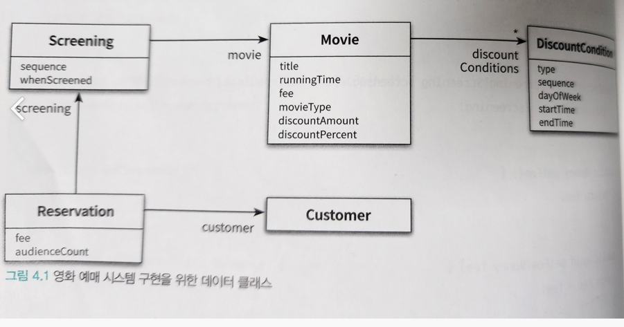
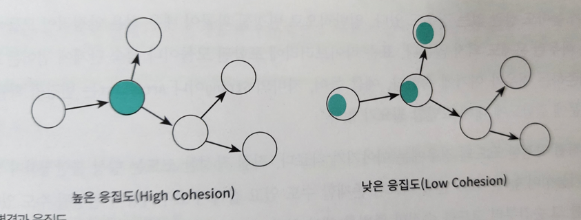
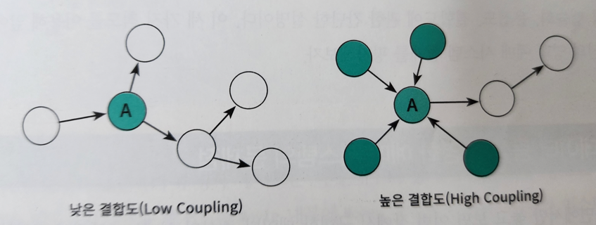

# 4장 설계 품질과 트레이드오프

> 객체지향 설계의 핵심은 역할, 책임, 협력 이다.

- 객체지향 설계란 올바른 객체에게 올바른 책임을 할당하면서 낮은 결합도와 높은 응집도를 가진 구조를 창조하는 활동이다.
- 훌륭한 설계란 합리적인 비용안에서 변경을 수용할 수 있는 구조를 만드는 것

---

## 1. 데이터 중심의 영화 예매 시스템

- 객체지향 설계에서 시스템을 객체를 분할하는 방법
  1. 상태를 분할의 중심 축으로 삼는 방법
  2. 책임을 분할의 중심축으로 삼는 방법


- 데이터 중심의 관점에서 객체는 자신이 포함하고 있는 데ㅐ이터를 조작하는데 필요한 오퍼레이션을 정의 한다.
- 책임 중심의 관점에서 객체는 다른 객체가 요청할 수 있는 오퍼레이션을 위해 필요한 상태를 보관한다.

```text
훌륭한 객체지향 설계는 데이터가 아니라 책임에 초점을 맞춰야 한다.
```

- 상태를 객체 분할의 중심으로 삼으면, 구현에 관한 세부사항이 객체의 인터페이스에 스며들게 되어 캡슐화의 원칙이 무너진다.
- 상태 변경은 인터페이스의 변경을 초래하며, 의존하는 모든 객체에게 변경의 영향이 퍼지게 된다.
- 데이터에 초점을 맞추는 설계는 변경에 취약할 수 밖에 없다.

---

- 객체의 책임은 인터페이스에 속한다
- 객체는 책임을 드러내는 안정적인 인터페이스 뒤로 책임을 수행하는데 필요한 상태를 캡슐화 함으로써, 구현 변경에 대한 파장이 외부로 퍼져나가는 것을 방지한다.
- 책임에 초점을 맞추면 상대적으로 변경에 안정적인 설계를 얻을 수 있게 된다.

---

### 데이터를 준비하자

> 데이터 중심의 설계는 객체가 내부에 저장해야 하는 '데이터가 무엇인가'를 묻는 것으로 시작한다.


```java
/* 에이터 중심 */
public class Movie {
    private String title;
    private Duration runningTime;
    private Money fee;
    private List<DiscountCondition> discountConditions;
    private MovieType movieType;
    private Money discountAmount;
    private double discountPercent;
}

/* 책임 중심 */
public class Movie {
    private String title;
    private Duration runningTime;
    private Money fee;
    private DefaultDiscountPolicy discountPolicy;
}
```
 
- 객체지향 설계와의 차이점
  1. 할인 조건의 목록(DiscountConditions) 이 인스턴스 변수로 Movie 안에 직접 포함돼 있다. 
  2. 할인 정책(DiscountPolicy)을 별도의 클래스로 분리하지 않고, 할인 금액(discountAmount)과 비율 할인 정책에 사용되는 할인 비율(discountPercent)을 Movie 안에서 정의한다.
  3. 할인 정책의 종류를 알기 위해 movieType 를 정의한다.

---

> 위 방법이 데이터 중심 접근 방법이다.

- 데이터 중심의 설계에서는 객체가 포함해야 하는 데이터에 집중한다.
- 객체의 책임을 결정하기 전에, 필요한 데이터가 무엇인가? 라는 질문의 반복에 휩쓸려 있다면 데이터 중심의 설계에 매몰돼 있을 확률이 높다.
- Movie 클래스처럼 객체의 종류를 저장하는 MovieType, 인스턴스 종류에 따라 배타적으로 사용될 discountAmount / discountPercent 를 하나의 클래스에 포함시키는 방식이 데이터 중심의 설계안에서 발생할 수 있는 패턴이다.

---

```java
public class Movie {
    private String title;
    private Duration runningTime;
    private Money fee;
    private List<DiscountCondition> discountConditions;
    private MovieType movieType;
    private Money discountAmount;
    private double discountPercent;

    public Money getFee() {
        return fee;
    }

    public void setFee(Money fee) {
        this.fee = fee;
    }

    public List<DiscountCondition> getDiscountConditions() {
        return discountConditions;
    }

    public void setDiscountConditions(List<DiscountCondition> discountConditions) {
        this.discountConditions = discountConditions;
    }

    public MovieType getMovieType() {
        return movieType;
    }

    public void setMovieType(MovieType movieType) {
        this.movieType = movieType;
    }

    public Money getDiscountAmount() {
        return discountAmount;
    }

    public void setDiscountAmount(Money discountAmount) {
        this.discountAmount = discountAmount;
    }

    public double getDiscountPercent() {
        return discountPercent;
    }

    public void setDiscountPercent(double discountPercent) {
        this.discountPercent = discountPercent;
    }
}
```

- Movie 를 구현하는 데 필요한 데이터를 결정했고, 메서드를 이용해 데이터를 캡슐화 하였다.

---

- 데이터 중심의 설계 방법으로 할인 조건을 설계하자
- 할인 조건을 구현하기 위해서는 할인조건을 저장할 데이터가 필요하다
- 할인 조건의 타입을 저장할 DiscountConditionType 을 정의하자

```java
public enum DiscountConditionType {
    SEQUENCE,
    PERIOD
}
```

---

- 할인 조건을 구현하는 DiscountCondition은 할인 조건의 타입을 저장할 데이터를 포함한다. (DiscountConditionType)
- 또한 순번 조건에 사용되는 데이터인 상영순번(sequence) 과 기간 조건에서 사용되는 요일(dayOfWeek), 시작 시간(startTime), 종료 시간(endTime) 을 포함한다.
- 캡슐화 원칙에 따라 메서드를 추가한다.

```java
public class DiscountCondition {
    private DiscountConditionType type;
    private int sequence;
    private DayOfWeek dayOfWeek;
    private LocalTime startTime;
    private LocalTime endTime;

    public DiscountConditionType getType() {
        return type;
    }

    public void setType(DiscountConditionType type) {
        this.type = type;
    }

    public int getSequence() {
        return sequence;
    }

    public void setSequence(int sequence) {
        this.sequence = sequence;
    }

    public DayOfWeek getDayOfWeek() {
        return dayOfWeek;
    }

    public void setDayOfWeek(DayOfWeek dayOfWeek) {
        this.dayOfWeek = dayOfWeek;
    }

    public LocalTime getStartTime() {
        return startTime;
    }

    public void setStartTime(LocalTime startTime) {
        this.startTime = startTime;
    }

    public LocalTime getEndTime() {
        return endTime;
    }

    public void setEndTime(LocalTime endTime) {
        this.endTime = endTime;
    }
}
```

---

- 이어서 Screening 클래스도 구현한다.

```java
public class Screening {
    private Movie movie;
    private int sequence;
    private LocalDateTime whenScreened;

    public Movie getMovie() {
        return movie;
    }

    public void setMovie(Movie movie) {
        this.movie = movie;
    }

    public int getSequence() {
        return sequence;
    }

    public void setSequence(int sequence) {
        this.sequence = sequence;
    }

    public LocalDateTime getWhenScreened() {
        return whenScreened;
    }

    public void setWhenScreened(LocalDateTime whenScreened) {
        this.whenScreened = whenScreened;
    }
}

```

---

- 영화 예매를 위한 Reservation 클래스도 추가한다.

```java
public class Reservation {
    private Customer customer;
    private Screening screening;
    private Money fee;
    private int audienceCount;

    public Reservation(Customer customer, Screening screening, Money fee, int audienceCount) {
        this.customer = customer;
        this.screening = screening;
        this.fee = fee;
        this.audienceCount = audienceCount;
    }

    public Customer getCustomer() {
        return customer;
    }

    public void setCustomer(Customer customer) {
        this.customer = customer;
    }

    public Screening getScreening() {
        return screening;
    }

    public void setScreening(Screening screening) {
        this.screening = screening;
    }

    public Money getFee() {
        return fee;
    }

    public void setFee(Money fee) {
        this.fee = fee;
    }

    public int getAudienceCount() {
        return audienceCount;
    }

    public void setAudienceCount(int audienceCount) {
        this.audienceCount = audienceCount;
    }
}
```

---

- Customer 는 고객의 정보를 보관하는 간단한 클래스이다.

```java
public class Customer {
    private String name;
    private String id;

    public Customer(String name, String id) {
        this.name = name;
        this.id = id;
    }
}
```

---

- 영화 예매 시스템을 위해 필요한 모든 데이터를 클래스로 구현했다.



---

### 영화를 예매하자

- ReservationAgency 는 데이터 클래스들을 조합해서 영화 예매 절차를 구현하는 클래스다.

```java
public class ReservationAgency {
    
    public Reservation reserve(Screening screening, Customer customer, int audienceCount) {
        Movie movie = screening.getMovie();
        
        boolean discountable = false;
        
        for (DiscountCondition condition : movie.getDiscountConditions()) {
            
            if (condition.getType() == DiscountConditionType.PERIOD) {
                discountable = 
                        screening.getWhenScreened().getDayOfWeek().equals(condition.getDayOfWeek()) &&
                        condition.getStartTime().compareTo(screening.getWhenScreened().toLocalTime()) <= 0 &&
                        condition.getEndTime().compareTo(screening.getWhenScreened().toLocalTime()) >= 0;
            } else {
                discountable = condition.getSequence() == screening.getSequence();
            }
            
            if (discountable) {
                break;
            }
        }

        Money fee;
        
        if (discountable) {
            Money discountAmount = switch (movie.getMovieType()) {
                case AMOUNT_DISCOUNT -> movie.getDiscountAmount();
                case PERCENT_DISCOUNT -> movie.getFee().times(movie.getDiscountPercent());
                case NONE_DISCOUNT -> movie.getDiscountAmount();
                default -> Money.ZERO;
            };
            
            fee = movie.getFee().minus(discountAmount);
        } else {
            fee = movie.getFee();
        }
        
        return new Reservation(customer, screening, fee, audienceCount);
    }
}
```

- reserve 메서드는 크게 두 부분으로 나눌 수 있다
  - 첫 번째, DiscountCondition 에 대해 루프를 돌면서 할인 가능 여부를 확인하는 for 문
  - 두 번째, discountable 변수의 값을 체크하고 적절한 할인 정책에 따라 예매 요금을 계산하는 if 문
- 할인 요금을 계산하기 위해서는 할인 정책의 타입에 따라 할인 요금을 계산하는 로직을 분기해야 한다.

---

## 2. 설계 트레이드오프

### 캠슐화

- 상태와 행동을 하나의 객체 안에 모으는 이유는 객체의 내부 구현을 외부로부터 감추기 위해서이다.
- 구현이란 나중에 변경될 가능성이 높은 어떤 것이다
- 객체지향이 강력한 이유는 한 곳에서 일어난 변경이 전체 시스템에 영향을 끼치지 않도록 파급효과를 적절하게 조절할 수 있는 장치를 제공한다.

```text
변경될 가능성이 높은 부분을 '구현' 이라고 부르고,
상대적으로 안정된 부분을 '인터페이스' 라고 부른다
```

- 객체지향에서 가장 중요한 원리는 캡슐화이다
- 구현과 인터페이스를 분리하고, 외부에서는 인터페이스에만 의존하도록 관계를 조절하는 것
- 캡슐화란 변경 가능성이 높은 부분을 객체 내부로 숨기는 추상화 기법이다.

---

### 응집도와 결합도

- 응집도
  - 모듈에 포함된 내부 요소들이 연관돼 있는 정도
  - 모듈 내의 요소들이 하나의 모듈을 위해 긴밀하게 협력한다면 그 모듈은 높은 응집도를 가진다
  - 객체지향 관점에서 응집도는 객체 또는 클래스에 얼마나 관련 높은 책임들을 할당했는지를 나타낸다.
- 결합도
  - 다른 모듈에 대해 얼마나 많은 지식을 갖고 있는지를 나타내는 척도 (의존성 정도)
  - 다른 모듈에 대해 너무 자세한 부분까지 알고 있다면 두 모듈은 높은 결합도를 갖는다
  - 객체지향 관점에서 결합도는 객체 또는 클래스가 협렵에 필요한 적절한 수준의 관계만을 유지하고 있는지를 나타낸다.

```text
일반적으로 좋은 설계란 높은 응집도와 낮은 결합도를 가진 모듈로 구성된 설계를 의미한다.
```

- 좋은 설계란 오늘의 기능을 수행하면서 내일의 변경을 수용할 수 있는 설계다
- 응집도와 결합도는 변경과 관련된 것이다

---




- 변경의 관점에서 응집도란 변경이 발생할 때 모듈 내부에서 발생하는 변경의 정도로 측정할 수 있다



- 응집도가 낮을수록 변경의 대상과 범위가 명확해지기 때문에 코드를 변경하기 쉬워진다
- 결합도는 한 모듈이 변경되기 위해서 다른 모듈의 변경을 요구하는 정도
- 결합도가 높으면 높을수록 함께 변경해야 하는 모듈의 수가 늘어나기 때문에 변경이 어려워진다.

---

> 결합도가 높아도 상관 없는 경우도 있다.

- 변경될 확률이 매우 적은 안정적인 모듈
- 표준라이브러리에 포함된 모듈
- 성숙 단계에 접어든 프레임워크에 의존하는 경우

> 직접 작성한 코드는 결합도가 낮아야한다.

- 직접 작성한 코드는 항상 불안정하며 변경될 가능성이 높다
- 낮은 결합도를 유지하려고 노력해야 한다

```text
캡슐화의 정도가 응집도와 결합도에 영향을 미친다.
```

---

## 3. 데이터 중심의 영화 예매 시스템의 문제점

- 데이터 중심의 설계는 캡슐화를 위반하고 객체의 내부 구현을 인터페이스의 일부로 만든다
- 반면 책임 중심의 설계는 내부 구현을 안정적인 인터페이스 뒤로 캡슐화 한다
- 데이터 중심의 설계가 가진 대표적인 문제점
  1. 캡슐화 위반
  2. 높은 결합도
  3. 낮은 응집도

---

### 캡슐화 위반

- 데이터 중심으로 설계한 Movie 클래스는 메서드를 통해서만 객체의 내부 상태에 접근할 수 있다.

```java
public class Movie {
    ...
    private Money fee;
    
    public Money getFee() {
        return fee;
    }

    public void setFee(Money fee) {
        this.fee = fee;
    }

    ...
}
```

```text
위 코드는 직접 객체의 내부에 접근할 수 없기 때문에 캡슐화의 원칙을 지키고 있는 것처럼 보인다.
```

- getFee, setFee 메서드는 Movie 내부에 Money 타입의 fee 라는 이름의 인스턴스 변수가 존재한다는 사실을 퍼블릭 인터페이스에 노골적으로 드러낸다.
- Movie 가 캡슐화 원칙을 어기게 된 근본적인 원인은 객체가 수행할 책임이 아니라, 내부에 저장할 데이터에 초점을 맞췄기 때문이다.
- 구현을 캡슐화 할 수 있는 적절한 책임은 협력이라는 문맥을 고려할 때만 얻을 수 있다.

```text
> 이처럼 접근자와 수정자에 과도하게 의존하는 설계방식을 추측에 의한 설계 전략 이라고 부른다.
> 이 전략은 객체가 사용될 협력을 고려하지 않고 객체가 다양한 상황에서 사용될 수 있을 것이라는 막연한 추측을 기반으로 설계를 진행한다. 
```

---

### 높은 결합도

- 데이터 중심의 설계는 접근자와 수정자를 통해 내부 구현을 인터페이스의 일부로 만들기 때문에 캡슐화를 위반한다.
- 객체 내부의 구현이 객체의 인터페이스에 드러난다는 것은 클라이언트가 구현에 강하게 결합된다는 것을 의미한다.
- 더 안좋은 점은 단지 객체의 내부 구현을 변경했음에도 이 인터페이스에 의존하는 모든 클라이언트들도 함께 변경해야 한다는 것이다.

---

```java
public class ReservationAgency {

    public Reservation reserve(Screening screening, Customer customer, int audienceCount) {
      ...

      Money fee;

      if (discountable) {
        ...
        fee = movie.getFee().minus(discountAmount);
      } else {
        fee = movie.getFee();
      }

      ...
    }
}
```

- 한 명의 예매 요금을 계산하기 위해 Movie 의 getFee 메서드를 호출하여 계산된 결과를 Movie 타입의 fee 에 저장한다.
- fee 의 타입을 변경한다고 가정하자
  - getFee 메서드의 반환 타입도 함께 수정해야 한다.
  - getFee 를 호출하는 ReservationAgency 의 구현도 변경된 타입에 맞게 함께 수정해야 할 것이다.
- fee 타입의 변경으로 인해 협력하는 클래스가 변경되기 때문에 getFee 메서드는 fee 를 정상적으로 캡슈로하 하지 못한다.
- getFee 메서드를 사용하는 것은 가시성을 public 으로 변경한 것과 거의 동일하다.


- 결합도 측면에서 또 다른 단점
  - 여러 데이터 객체들을 사용하는 제어로직이 특정 객체 안에 집중되기 때문에 하나의 제어 객체가 다수의 데이터 객체에 강하게 결합된다는 것이다.
  

> 대부분의 제어 로직을 가지고 있는 제어 객체인 ReservationAgency 가 모든 데이터 객체에 의존하고 있다

- 데이터 중심의 설계는 전체 시스템을 하나의 거대한 의존성 덩어리로 만들어 버리기 때문에 어떤 변경이라도 발생하고 나면 시스템 전체가 요동칠 수밖에 없다.

---

### 낮은 응집도

- 서로 다른 이유로 변경되는 코드가 하나의 모듈 안에 공존할 때 모듈의 응집도가 낮다고 말한다.
- 응집도를 살펴보기 위해서는 코드를 수정하는 이유가 무엇인지 살펴봐야 한다
- ReservationAgency 를 예로 들어 변경과 응집도 관계를 살펴보자
  - 할인 정책이 추가될 경우
  - 할인 정책별로 할인 요금을 계산하는 방법이 변경될 경우
  - 할인 조건이 추가되는 경우
  - 할인 조건별로 할인 여부를 판단하는 방법이 변경될 경우
  - 예매 요금을 계산하는 방법이 변경될 경우
- 낮은 응집도는 두 가지 측면에서 설계에 문제를 일으킨다
  - 변경의 이유가 서로 다른 코드들을 하나의 모듈안에 뭉쳐놓았기 때문에 변경과 아무 상관이 없는 코드들이 영향을 받게 된다
  - 하나의 요구사항 변경을 반영하기 위해 동시에 여러 모듈을 수정해야 한다
- 현재의 설계에서 새로운 할인 정책을 추가하거나 새로운 할인 조건을 추가하기 위해 하나 이상의 클래스를 동시에 수정해야 한다
  - 응집도가 낮다

---

#### 단일 책임의 원칙

- 클래스는 단 한가지의 변경 이유만 가져야 한다.
- 단일 책임 원칙이라는 맥락에서 '책임' 이라는 말이 '변경의 이유'로 사용이 된다.

---

## 4. 자율적인 객체를 향해

### 캡슐화를 지켜라

- 메서드는 단순히 속성 하나의 값을 반환하거나 변경하는 접근자나 수정자를 의미하는 것은 아니다
- 객체에게 의미 있는 메서드는 객체가 책임져야 하는 무언가를 수행하는 메서드다
- 속성의 가시성을 private 로 설정했다고 해도 접근자와 수정자를 통해 속성을 외부로 제공하고 있다면 캡슐화를 위반하는 것이다.

> private 필드마다 접근자 와 수정자가 있다면, 필드가 추가 및 변경이 될 때마다 접근자와 수정자가 수정이 되고, 이 변경은 접근자와 수정자를 사용한 모든 코드에 영향을 미친다.

---

### 스스로 자신의 데이터를 책임지는 객체

- 상태와 행동을 객체라는 하나의 단위로 묶는 이유는 객체 스스로 자신의 상태를 처리할 수 있게 하기 위해서다
- 객체 내부에 저장되는 데이터보다 객체가 협력에 참여하면서 수행할 책임을 정의하는 오퍼레이션이 더 중요하다
- 객체를 설계할 때, "이 객체가 어떤 데이터를 포함해야 하는가" 라는 질문의 다음과 같은 두 개의 개별 질문으로 분리해야 한다.
  - 이 객체가 어떤 데이터를 포함해야 하는가?
  - 이 객체가 데이터에 대해 수행해야 하는 오퍼레이션은 무엇인가?


- 영화 예매 시스템으로 돌아가 ReservationAgency 로 새어나간 데이터에 대한 책임을 실제 데이터를 포함하고 있는 객체로 옮겨보자

```java
public class DiscountCondition {
    private DiscountConditionType type;
    private int sequence;
    private DayOfWeek dayOfWeek;
    private LocalTime startTime;
    private LocalTime endTime;
}
```

- 할인 조건을 표현하는 DiscountCondition 에서 시작하자
  - 첫 번째 질문 - 어떤 데이터를 관리해야 하는지 ?
    - 앞에서 DiscountCondition 이 관리해야 하는 데이터를 결정해 놓았다
  - 두 번째 질문 - 데이터에 대해 수행할 수 있는 오퍼레이션이 무엇인가
    - DiscountCondition 은 순번 조건인 경우에는 sequence 를 이용해서 할인 여부를 결정하고, 기간 조건인 경우에는 dayOfWeek, startTime, endTime 을 이용해 할인 여부를 결정한다.

```java
public class DiscountCondition {
    private DiscountConditionType type;
    private int sequence;
    private DayOfWeek dayOfWeek;
    private LocalTime startTime;
    private LocalTime endTime;

    public DiscountConditionType getType() {
        return type;
    }

    public boolean isDiscountable(DayOfWeek dayOfWeek, LocalTime time) {

        if (type != DiscountConditionType.PERIOD) {
            throw new IllegalArgumentException();
        }

        return this.dayOfWeek.equals(dayOfWeek) &&
                this.startTime.compareTo(time) <= 0 &&
                this.endTime.compareTo(time) >= 0;
    }

    public boolean isDiscountable(int sequence) {

        if (type != DiscountConditionType.SEQUENCE) {
            throw new IllegalArgumentException();
        }

        return this.sequence == sequence;
    }
}
```

- 두 가지 할인 조건을 판단할 수 있게 두개의 isDiscountable 메서드가 필요할 것이다.
- 각 isDiscountable 메서드 안에서 type 의 값을 이용해 현재의 할인 조건 타입에 맞는 적절한 메서드가 호출 됐는지 판단한다.

---

```java
public class Movie {
    private String title;
    private Duration runningTime;
    private Money fee;
    private List<DiscountCondition> discountConditions;
    private MovieType movieType;
    private Money discountAmount;
    private double discountPercent;
}
```

- Movie 를 구현하자
  - 첫 번째 질문 - Movie 가 어떤 데이터를 포함해야 하는가?
  - 두 번째 질문 
    - 요금을 계산하는 오퍼레이션 필요
    - 요금을 계산하기 위해서는 할인 정책을 염두해 둬야 한다.
    - 할인 정책의 타입을 반환하는 getMovieType 메서드와 정책별로 요금을 계산하는 세 가지 메서드를 구현해야 한다.

```java
public class Movie {
    private String title;
    private Duration runningTime;
    private Money fee;
    private List<DiscountCondition> discountConditions;
    private MovieType movieType;
    private Money discountAmount;
    private double discountPercent;

    public MovieType getMovieType() {
        return movieType;
    }

    public Money calculateAmountDiscountedFee() {

        if (movieType != MovieType.AMOUNT_DISCOUNT) {
            throw new IllegalArgumentException();
        }

        return fee.minus(discountAmount);
    }

    public Money calculatePercentDiscountedFee() {

        if (movieType != MovieType.PERCENT_DISCOUNT) {
            throw new IllegalArgumentException();
        }

        return fee.minus(fee.times(discountPercent));
    }

    public Money calculateNoneDiscountedFee() {

        if (movieType != MovieType.NONE_DISCOUNT) {
            throw new IllegalArgumentException();
        }

        return fee;
    }

    public boolean isDiscountable(LocalDateTime whenScreened, int sequence) {
  
      for (DiscountCondition condition : discountConditions) {  
          if (condition.getType() == DiscountConditionType.PERIOD) {
            if (condition.isDiscountable(whenScreened.getDayOfWeek(), whenScreened.toLocalTime())) {
                return true;
            }
          } else {
            if (condition.isDiscountable(sequence)) {
                return true;
            }
          }
      }
      
      return false;
    }
}
```

- isDiscountable 메서드는 discountCondtions 를 하나씩 훑어 가면서 할인 조건의 타입을 체크한다.

---

```java
public class Screening {
    private Movie movie;
    private int sequence;
    private LocalDateTime whenScreened;

    public Screening(Movie movie, int sequence, LocalDateTime whenScreened) {
        this.movie = movie;
        this.sequence = sequence;
        this.whenScreened = whenScreened;
    }
    
    public Money calculateFee(int audienceCount) {
        
        switch (movie.getMovieType()) {
            case AMOUNT_DISCOUNT -> {
                if (movie.isDiscountable(whenScreened, sequence)) {
                    return movie.calculateAmountDiscountedFee().times(audienceCount);
                }
            }
            case PERCENT_DISCOUNT -> {
                if (movie.isDiscountable(whenScreened, sequence)) {
                    return movie.calculatePercentDiscountedFee().times(audienceCount);
                }
            }
            case NONE_DISCOUNT -> {
                return movie.calculateNoneDiscountedFee().times(audienceCount);
            }
        }
        
        return movie.calculateNoneDiscountedFee().times(audienceCount);
    }
}
```

- Screening 은 Movie 가 할인 정책이나 비율 할인 정책을 지원할 경우 Movie 의 isDiscountable 메서드를 호출해 할인이 가능한지 여부를 판단한다
- 그 후 적절한 Movie의 요금 계산 메서드를 호출해서 요금을 계산한다.

---

```java
public class ReservationAgency {

    public Reservation reserve(Screening screening, Customer customer, int audienceCount) {
        Money fee = screening.calculateFee(audienceCount);

        return new Reservation(customer, screening, fee, audienceCount);
    }
}
```

- RevervationAgency 는 Screening 의 calculationFee 메서드를 호출해 예매 요금을 계산한 후 계산된 요청을 이용해 Reservation 을 생성한다.

---

## 5. 하지만 여전히 부족하다

### 캡슐화 위반

- 수정된 객체들은 자기 자신의 데이터를 스스로 처리한다.
- 예를들어 DiscountCondition 은 자기 자신의 데이터를 이용해 할인 가능 여부를 스스로 판단한다.

```java
public class DiscountCondition {
    private DiscountConditionType type;
    private int sequence;
    private DayOfWeek dayOfWeek;
    private LocalTime startTime;
    private LocalTime endTime;

    public DiscountConditionType getType() {
        return type;
    }

    public boolean isDiscountable(DayOfWeek dayOfWeek, LocalTime time) {

        if (type != DiscountConditionType.PERIOD) {
            throw new IllegalArgumentException();
        }

        return this.dayOfWeek.equals(dayOfWeek) &&
                this.startTime.compareTo(time) <= 0 &&
                this.endTime.compareTo(time) >= 0;
    }

    public boolean isDiscountable(int sequence) {

        if (type != DiscountConditionType.SEQUENCE) {
            throw new IllegalArgumentException();
        }

        return this.sequence == sequence;
    }
}
```

> DiscountCondition 에 구현된 두 개의 isDiscountable 메서드를 자세히 살펴보면 이상한 점이 몇 군데 눈에 띈다

- isDiscountable(DayOfWeek dayOfWeek, LocalTime time) 
  - 메서드의 시그니처는 DiscountCondition 에 속성으로 포함돼 있는 DayofWeek 타입의 요일 정보와 LocalTime 타입의 시간정보를 파라미터로 받고 있다.
  - 이 메서드는객체 내부에 DayofWeek 타입의 요일과 LocalTime 타입의 시간 정보가 인스턴스 변수로 포함돼 있다는 사실을 인터페이스를 통해 외부에 노출하고 있다
- isDiscountable(int sequence)
  - 객체가 int 타입의 순번 정보를 포함하고 있음을 외부에 노출한다.
  - setType 메서드는 없지만 getType 메서드를 통해 내부에 DiscountCondition 의 속성을 포함하고 있다는 정보 역시 노출 시키고 있다.

> 만약 DiscountCondition 의 속성을 변경해야 한다면 어떻게 될까 ?

- isDiscountable 메서드의 파라미터를 수정해야 한다
- 메서드를 사용하는 모든 클라이언트도 함께 수정해야 한다
- 내부 구현의 변경이 외부로 퍼져나가는 파급 효과는 캡슐화가 부족하다는 명백한 증거다.
- 내부의 구현을 캡슐화하는 데는 실패한 것이다.

> Movie 역시 캡슐화가 부족하다.

```java
public class Movie {
    private String title;
    private Duration runningTime;
    private Money fee;
    private List<DiscountCondition> discountConditions;
    private MovieType movieType;
    private Money discountAmount;
    private double discountPercent;

    public MovieType getMovieType() {
        return movieType;
    }
    
    public boolean isDiscountable(LocalDateTime whenScreened, int sequence) {
        
        for (DiscountCondition condition : discountConditions) {
            if (condition.getType() == DiscountConditionType.PERIOD) {
                if (condition.isDiscountable(whenScreened.getDayOfWeek(), whenScreened.toLocalTime())) {
                    return true;
                }
            } else {
                if (condition.isDiscountable(sequence)) {
                    return true;
                }
            }
        }
        
        return false;
    }

    public Money calculateAmountDiscountedFee() {

        if (movieType != MovieType.AMOUNT_DISCOUNT) {
            throw new IllegalArgumentException();
        }

        return fee.minus(discountAmount);
    }

    public Money calculatePercentDiscountedFee() {

        if (movieType != MovieType.PERCENT_DISCOUNT) {
            throw new IllegalArgumentException();
        }

        return fee.minus(fee.times(discountPercent));
    }

    public Money calculateNoneDiscountedFee() {

        if (movieType != MovieType.NONE_DISCOUNT) {
            throw new IllegalArgumentException();
        }

        return fee;
    }
}

```

- Movie 의 요금 계산 메서드들은 객체의 파라미터나 반환 값으로 내부에 포함된 속성에 대한 어떤 정보도 노출하지않는다.
- 따라서, 캡슐화의 원칙을 지키고 있다고 생각할 것이다.
- 하지만 Movie 역시 내부 구현을 인터페이스에 노출시키고 있다.
- 노출시키는 것은 할인 정책의 종류다
  - calculateAmountDiscountedFee
  - calculatePercentDiscountedFee
  - calculateNoneDiscountedFee
- 위 3개의 메서드는 할인 정책에 세 가지가 존재한다는 사실을 만천하에 드러내고 있다.

> 만약 새로운 할인 정책이 추가되거나 제거된다면 어떻게 될 것인가?

- 이 메서드들에 의존하는 모든 클라이언트가 영향을 받을 것이다.
- Movie 는 세 가지 할인 정책을 포함하고 있다는 내부 구현을 성공적으로 캡슐화 하지 못한다.

---

#### 캡슐화의 진정한 의미

- 캡슐화가 단순히 객체 내부의 데이터를 외부로부터 감추는 것 이상의 의미를 가진다는 것을 잘 보여준다.
- 내부 속성을 외부로부터 감추는 것은 '데이터 캡슐화' 라 불리는 캡슐화의 한 종류이다.
- 캡슐화란 변할 수 있는 어떤 것이라도 감추는 것이다.
- 그것이 속성의 타입이건, 할인 정책의 종류건 상관 없이 내부 구현의 변경으로 인해 외부의 객체가 영향을 받는다면 캡슐화를 위반한 것이다.

---

### 높은 결합도 

- 캡슐화 위반으로 인해 DiscountCondition 의 내부 구현이 외부로 노출됐기 때문에 Movie 와 DiscountCondition 사이의 결합도는 높을 수 밖에 없다
- Movie 의 isDiscountable 메서드 구현을 살펴보면서 Movie 와 Discount 사이의 결합도가 어떤 문제를 초래하는지 고민해보자

```java
public boolean isDiscountable(LocalDateTime whenScreened, int sequence) {
        
    for (DiscountCondition condition : discountConditions) {
        if (condition.getType() == DiscountConditionType.PERIOD) {
            if (condition.isDiscountable(whenScreened.getDayOfWeek(), whenScreened.toLocalTime())) {
                return true;
            }
        } else {
            if (condition.isDiscountable(sequence)) {
                return true;
            }
        }
    }
    
    return false;
}

```

- isDiscountable 메서드는 DiscountCondition 목록을 순회하면서 할인 조건의 종류에 따라 DiscountCondition 에 구현된 두 개의 isDiscountable 메서드 중에서 적절한 것을 호출한다.
  - DiscountCondition 의 기간 할인 조건의 명칭이 PERIOD 에서 다른 값으로 변경된다면 Movie 를 수정해야 한다
  - DiscountCondition 의 종류가 추가되거나 삭제된다면 Movie 안의 if ~ else 구문을 수정해야 한다
  - 각 DiscountCondition 의 만족 여부를 판단하는 데 필요한 정보가 변경된다면 Movie 의 isDiscountable 메서드로 전달된 파라미터를 변경해야 한다.
  - 이로 인해 Movie 의 isDiscountable 메서드 시그니처도 함께 변경될 것이고 
  - 결과적으로 이 메서드에 의존하는 Screening 에 대한 변경을 초래할 것이다.
- 이 요소들이 DiscountCondition 의 구현에 속한다는 사실에 주목해야 한다
- DiscountCondition 의 인터페이스가 아니라 '구현' 을 변경하는 경우에도 DiscountCondition 에 의존하는 Movie 를 변경해야 한다는 것은 두객체 사이의 결합도가 높다는 것을 의미한다.

---

### 낮은 응집도

- Screening 을 살펴봤을 때, DiscountCondition 이 할인 여부를 판단하는데 필요한 정보가 변경된다면 Movie 의 isDiscountable 메서드로 전달해야 하는 파라미터의 종류를 변경해야 하고, 
- 이로 인해 Screening 에서 Movie 의 isDiscountable 메서드를 호출하는 부분도 함께 변경해야 한다.

```java
public Money calculateFee(int audienceCount) {
    
    switch (movie.getMovieType()) {
        case AMOUNT_DISCOUNT -> {
            if (movie.isDiscountable(whenScreened, sequence)) {
                return movie.calculateAmountDiscountedFee().times(audienceCount);
            }
        }
        case PERCENT_DISCOUNT -> {
            if (movie.isDiscountable(whenScreened, sequence)) {
                return movie.calculatePercentDiscountedFee().times(audienceCount);
            }
        }
        case NONE_DISCOUNT -> {
            return movie.calculateNoneDiscountedFee().times(audienceCount);
        }
    }
    
    return movie.calculateNoneDiscountedFee().times(audienceCount);
}
```

- 할인 조건의 종류를 변경하기 위해서 DiscountCondition, Movie, Movie 를 사용하는 Screening 을 함께 수정해야 한다.
- 하나의 변경을 위해 여러 곳을 동시에 수정한다는 것은 응집도가 낮다는 증거다.
- DiscountCondition 과 Movie 의 내부 구현이 인터페이스에 그대로 노출되고 있고, screening 은 노출된 구현에 직접적으로 의존하고 있다.
- DiscountCondition 이나 Movie 에 위치해야 하는 로직이 Screening 으로 새어나왔기 때문이다.

---

## 6. 데이터 중심 설계의 문제점

- 데이터 중심 설계가 변경에 취약한 이유
  1. 본질적으로 너무 이른 시기에 데이터에 관해 결정하도록 강요한다
  2. 협력이라는 문맥을 고려하지 않고 객체를 고립시킨 채 오퍼레이션을 결정한다


### 데이터 중심 설계는 객체의 행동보다는 상태에 초점을 맞춘다.

- 데이터는 구현의 일부라는 사실을 명심하라
- 데이터 주도 설계는 설계를 시작하는 처음부터 데이터에 관해 결정하도록 강요하기에, 너무 이른 시기에 내부 구현에 초점을 맞추게 한다.
- 데이터 중심 설계 방식에 익숙한 개발자들은 일반적으로 데이터와 기능을 분리하는 절차적 프로그래밍 방식을 따른다.
- 이것은 상태와 행동을 하나의 단위로 캡슐화 하는 객체지향 패러다임에 반하는 것이다.
- 접근자와 수정자는 public 속성과 큰 차이가 없기 때문에 객체의 캡슐화는 완전히 무너질 수 밖에 없다.
- 데이터와 데이터를 처리하는 작업을 같은 객체 안에 두더라도 데이터에 초점이 맞춰져 있다면 만족스러운 캡슐화를 얻기 어렵다.
- 데이터를 먼저 결정하고 데이터를 처리하는 데 필요한 오퍼레이션을 나중에 결정하는 방식은 데이터에 관한 지식이 객체의 인터페이스에 고스란히 드러나게 된다.
- 결과적으로 객체의 인터페이스는 구현을 캡슐화하는 데 실패하고 코드는 변경에 취약해 진다.

### 데이터 중심 설계는 객체를 고립시킨 채 오퍼레이션을 정의하도록 만든다.

- 객체지향을 구현한다는 것은 객체들의 공동체를 구축한다는 것을 의미한다.
- 협력이라는 문맥 안에서 필요한 책임을 결정하고 이를 수행할 적절한 객체를 결정하는 것이 가장 중요하다.
- 객체지향 무게중심은 내부가 아니라 외부에 맞춰져 있어야 한다
- 데이터 중심 설계는 객체의 내부에 초점이 향한다
  - `객체의 구현이 이미 결정된 상태에서 다른 객체의 협력 방법을 고민하기 때문에 이미 구현된 객체의 인터페이스를 억지로 끼워맞출 수 밖에 없다`
  - 객체의 인터페이스에 구현이 노출돼 있었기 때문에 협력이 구현 세부사항에 종속돼 있고
  - 객체의 내부 구현이 변경됐을때 협력하는 객체 모두가 영향을 받을 수밖에 없었다