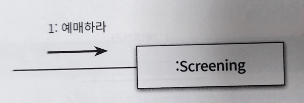
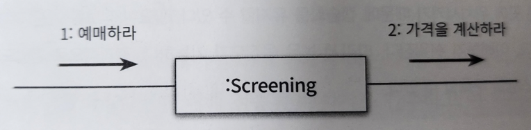
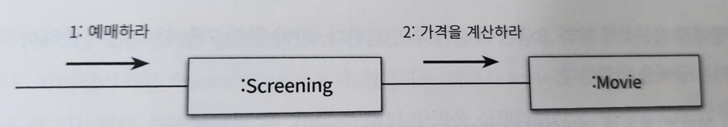
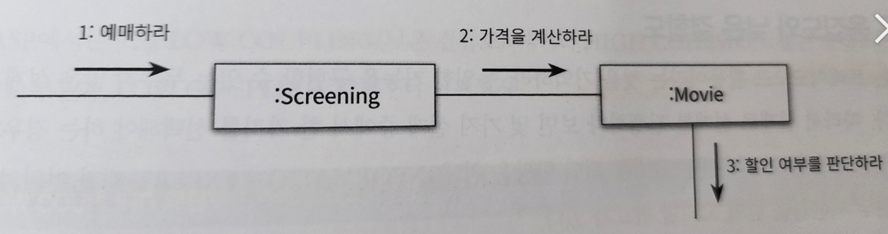
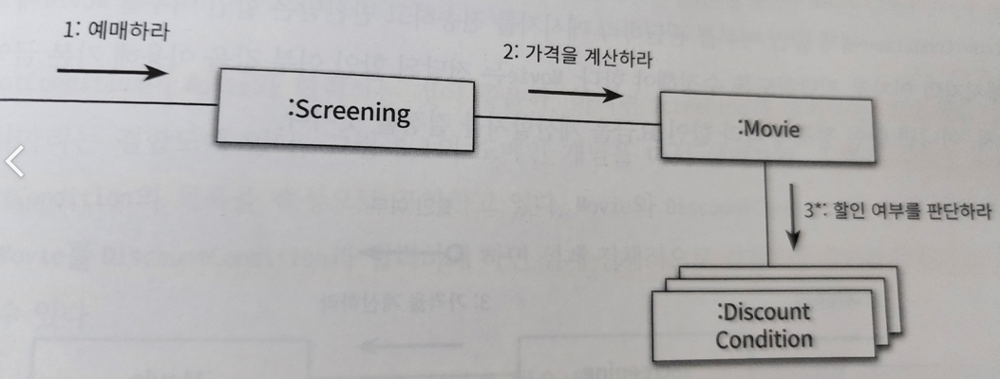
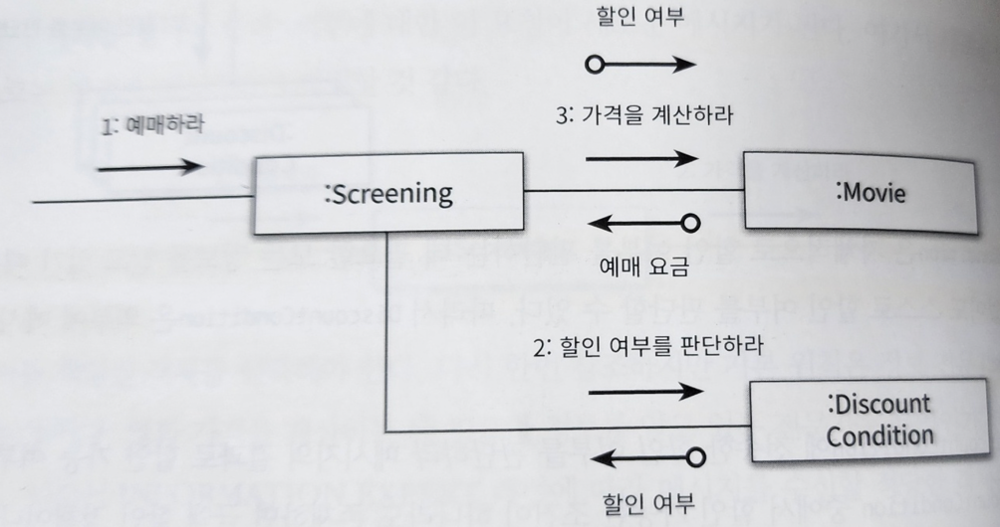

# 5장 책임 할당하기

> 올바른 책임을 할당하기 위해서는 다양한 관점에서 설계를 평가할 수 있어야 한다

- GRASP 패턴은 책임 할당의 어려움을 해결하기 위한 답을 제시해 줄 것이다
- 응집도와 집합도, 캡슐화 같은 다양한 기준에 따라 책임을 할당하고 결과를 트레이드오프 할 수 있는 기준을 제시한다

---

## 1. 책임 주도 설계를 향해

> 책임 중심의 설계 <br>
> 1. 데이터보다 행동을 먼저 결정하라
> 2. 협력이라는 문맥 안에서 책임을 결정하라

---

### 데이터보다 행동을 먼저 결정하라

> 객체에게 중요한 것은 데이터가 아니라 외부에 제공하는 행동이다

- 우리에게 필요한 것은 객체의 데이터에서 행동으로 무게 중심을 옮기기 위한 기법이다
- 해결 방법은 객체를 설계하기 위한 질문의 순서를 바꾸는 것이다
- `데이터 중심의 설계`애서는 "이 객체가 포함해야 하는 데이터가 무엇인가" 를 결정한 후에 "데이터를 처리하는 데 필요한 오퍼레이션은 무엇인가" 를 결정한다
- `책임 중심의 설계`에서는 "이 객체가 수행해야 하는 책임은 무엇인가" 를 결정한 후에 "이 책임을 수행하는 데 필요한 데이터는 무엇인가"를 결정한다
- 책임 중심의 설계에서는 객체의 행동, 즉 책임을 먼저 결정한 후에 객체의 상태를 결정한다는 것이다

### 협력이라는 문맥 안에서 책임을 결정하라

> 객체에게 할당된 책임의 품질은 협력에 적합한 정도로 결정된다

- 책임은 객체의 입장이 아니라 객체가 참여하는 협력에 적합해야 한다
- 협력을 시작하는 주체는 메시지 전송자이다
- 적합한 책임이란 메시지 수신자가 아니라 메시지 전송자에게 적합한 책임을 의미한다
- 메시지를 전송하는 클라이언트의 의도에 적합한 책임을 할당해야 한다
- 협력에 적합한 책임을 수확하는 방법
  - 메시지를 결정한 후에 객체를 선택해야 한다
  - 객체가 메시지를 선택하는 것이 아니라 메시지가 객체를 선택하게 해야 한다
- 메시지가 클라이언트의 의도를 표현한다
- 메시지를 수신하기로 결정된 객체는 메시지를 처리할 책임을 할당받게 된다
- 메시지를 먼저 결정하기 때문에 메시지 송신사는 메시지 수신자에 대한 어떠한 가정도 할 수 없다
- 전송자의 관점에서 메시지 수신자가 깔끔하게 캡슐화 된다
- 협력이라는 문맥 안에서 메시지에 집중하는 책임 중심의 설계는 캡슐화의 원리를 지키기가 훨씬 쉬워진다

### 책임 주도 설계

- 시스템 책임을 파악한다
- 시스템 책임을 더 작은 책임으로 분할한다
- 분할된 책임을 수행할 수 있는 객체 또는 역할을 찾아 할당한다
- 객체가 책임을 수행하는 도중 다른 객체의 도움이 필요한 경우 이를 책임질 적절한 객체 또는 역할을 찾는다
- 해당 객체 또는 역할에게 책임을 할당함으로써 두 객체가 협력하게 된다

---

## 2. 책임 할당을 위한 GRASP 패턴

> GRASP 패턴은 객체에게 책임을 할당할 때 지침으로 삼을 수 있는 원칙들의 집합을 패턴으로 정리한 것

### 도메인 개념에서 출발하기

- 설계를 시작하기 전에 도메인에 대한 개략적인 모습을 그려보는 것이 유용하다
- 설계를 시작하는 단계
  - 개념들의 의미와 관계가 정확하거나 완벽할 필요가 없다
  - 그저 출발점이 필요할 뿐이다
  - 책임을 할당받을 객체들의 종류와 관계에 대한 유용한 정보를 제공할 수 있다면 충분하다
  - 개념들의 모음 정도로 간주하라
  - 중요한 것은 설계를 시작하는 것이지 완벽하게 정리하는 것이 아니다

### 정보 전문가에게 책임을 할당하라

- 책임 주도 설계 방식 (영화 예매 예시)
  1. 제공해야 하는 기능을 책임으로 생각하기
  2. 메시지를 책임질 첫 번째 객체를 선택하는 것으로 설계를 시작한다
  3. 사용자에게 제공해야 하는 기능은 영화를 예매하는 것이다
  4. 책임을 수행하는 데 필요한 메시지를 결정해야 한다
  5. 메시지를 수신할 객체가 아니라 메시지를 전송할 객체의 의도를 반영해서 결정해야 한다

---

> 첫 번째 질문 - 메시지를 전송할 객체는 무엇을 원하는가?

- 협력을 시작하는 객체는 미정이지만 이 객체가 원하는 것은 분명하다
- 메시지의 이름으로는 `예매하라` 가 적절한 것같다


---

> 두 번째 질문 - 메시지를 수신할 적합한 객체는 누구인가?

- 객체가 상태와 행동을 통합한 캡슐화의 단위라는 사실에 집중해야 한다
- 객체에게 책임을 할당하는 첫 번째 원칙은 책임을 수행할 정보를 알고 있는 객체에게 책임을 할당하는 것이다
- GRASP 에서는 이를 `정보 전문가` 패턴 이라 부른다
  - 객체가 자신이 소유하고 있는 정보와 관련된 작업을 수행한다는 일반적인 직관을 표현한 것이다
  - 정보는 데이터와 다르다는 사실에 주의하라
  - 책임을 수행하는 객체가 정보를 '알고' 있다고 해서 그 정보를 '저장' 하고 있을 필요는 없다
  - 정보 전문가가 데이터를 반드시 저장하고 있을 필요는 없다는 사실을 이해하는 것이 중요하다
- 정보 전문가 패턴에 따르면 예매하는데 필요한 정보를 가장 많이 알고 있는 객체에게 `예매하라` 메시지를 처리할 책임을 할당해야 한다
- '상영' 이라는 도메인이 적합할 것이다



---

> '예매하라' 메시지를 수신했을 때 Screening 이 수행해야 하는 작업의 흐름을 생각해보자

- Screening 이 책임을 수행하는 데 필요한 작업을 구상해보고 스스로 처리할 수 없는 작업이 무엇인지를 가릴 정도의 수준이면 된다
- 스스로 처리할 수 없는 작업이 있다면 외부에 도움을 요청해야 한다
- 이 요청이 새로운 객체의 책임으로 할당된다
- '예매하라' 메시지를 완료하기 위해서는 예매 가격을 계산하는 작업이 필요하다
- Screening 은 가격을 계산하는 데 필요한 정보를 모르기 때문에 외부의 객체에 요청이 필요하다
- 이 외부에 대한 요청이 새로운 메시지가 된다
- 새로운 메시지의 이름으로는 '가격을 계산하라' 가 적절할 것이다



---

> 이제 메시지를 책임질 객체를 선택해야 한다.

- 영화 가격을 계산하는데 필요한 정보를 알고 있는 전문가는 '영화' 이다



---

> 가격을 계산하기 위해 Movie 가 어떤 작업을 해야 하는지 생각해보자

- 할인 조건에 따라 영화가 할인 가능한지를 판단한지는 영화가 스스로 판단할 수 없다
- Movie 는 '할인 여부를 판단하라' 메시지를 전송해서 외부의 도움을 요청해야 한다



---

> 할인 여부를 판단하는 데 필요한 정보를 가장 많이 알고 있는 객체는 누구인가?

- 할인 조건 (DiscountCondition) 에게 이 책임을 할당하자



---

- DiscountCondition 은 자체적으로 할인 여부를 판단하는 데 필요한 모든 정보를 알고 있다
- 그렇기에 외부의 도움 없이도 스스로 할인 여부를 판단할 수 있다
- 따라서 외부에 메시지를 전송하지 않는다


> 위와 같이, 정보 전문가 패턴을 따르는 것만으로도 자율성이 높은 객체들로 구성된 협력 공동체를 구축할 가능성이 높아진다

---

### 높은 응집도와 낮은 결합도

> 설계는 트레이드 오프 이며, 올바른 책임 할당을 위해 정보 전문가 패턴 이외의 다른 패턴을 고려할 필요가 있다

- 할인 요금을 계산하기 위해 Movie 가 DiscountCondition 에 할인 여부를 판단하라 메시지를 전송한다
- 이 설계의 대안으로 Movie 대신 Screening 이 직접 DiscountCondition 과 협력하는 것은 어떨까?



- 기능적인 측면에서만 보면 Movie 와 DiscountCondition 이 직접 상호작용하는 앞의 설계와 동일하다
- 차이점은 DiscountCondition 과 협력하는 객체가 Movie 가 아니라 Screening 이라는 것이다

> 왜 우리는 Movie 가 DiscountCondition 과 협력하는 방법을 선택한 것인가?

- 그 이유는 응집도와 결합도에 있다
- 도메인 상으로는 Movie 는 DiscountCondition 의 목록을 속성으로 포함하고 있다
- Movie 를 DiscountCondition 과 협력하게 하면 설계 전체적으로 결합도를 추가하지 않고도 협력을 완성할 수 있다
- 하지만, Screening 이 협력할 경우에는 Screeing 과 DiscountCondition 사이에 새로운 결합도가 추가된다
  - 낮은 결합도 측면에서 Movie 가 협력하는 것이 더 나은 설계 대안이다

---

- Screening 의 가장 중요한 책임은 얘매를 생성하는 것이다
- Screening 이 DiscountCondition 과 협력해야 한다면 요금 계산과 관련된 책임일부를 맡아야 한다
  - 책임을 나눠 갖기에 응집도가 낮아진다
- Movie 의 주된 책임은 영화 요금을 계산하는 것이다
- 영화 요금을 계산하기 위해 Movie 와 DiscountCondition 이 협력하는 것은 응집도에 아무런 해도 끼치지 않는다
  - 높은 응집도 측면에서 Movie 가 협력하는 것이 더 나은 설계 대안이다

---

### 창조자에게 객체 생성 책임을 할당하라

- 영화 예매 협력의 최종 결과물은 Reservation 인스턴스를 생성하는 것이다
- 협력에 참여하는 어떤 객체는 Reservation 인스턴스 생성 책임을 할당해야 한다
- 창조자 패턴은 객체 생성 책임을 어떤 객체에게 할당할지 지침을 제공한다
- 창조자 패턴 (B가 A생성 책임을 갖는다)
  - B 가 A 객체를 포함하거나 참조한다
  - B 가 A 객체를 기록한다
  - B 가 A 객체를 긴밀하게 사용한다
  - B 가 A 객체를 초기화하는 데 필요한 데이터를 가지고 있다 (B 는 A 에 대한 정보 전문가 이다)
- 창조자 패턴의 관점으로, Reservation 을 가장 잘 알고 있는 Screening 이 Reservation 생성 책임을 갖는것이 적절하다

---

## 3. 구현을 통한 검증

- Screening 은 영화 예매 책임과 함께 Reservation 인스턴스 생성 책임을 수행해야 한다
- Movie 에 전송하는 메시지의 시그니처를 calculateMovieFee(Screening screening) 으로 선언했다
  - 이 메시지는 수신자인 Movie 가 아니라 송신자인 Screening 의 의도를 표현한다
  - Movie 의 구현을 고려하지 않고 필요한 메시지를 결정하면 Movie 의 내부 구현을 깔끔하게 캡슐화 할 수 있다

```java
public class Screening {
    private Movie movie;
    private int sequence;
    private LocalDateTime whenScreened;
    
    public Reservation reserve(Customer customer, int audienceCount) {
        return new Reservation(customer, this, calculateFee(audienceCount), audienceCount);
    }
    
    private Money calculateFee(int audienceCount) {
        return movie.calculateMovieFee(this).times(audienceCount);
    }
}

```

---

- Movie 는 discountConditions 의 원소를 순회하면서 isSatisfiedBy 메시지를 전송해 할인 여부를 판단하도록 요청한다
- 실제로 할인 요금을 계산하는 calculateDiscountAmount 메서드는 movieType 에 따라 적절한 메서드를 호출한다

```java
public class Movie {
  private String title;
  private Duration runningTime;
  private Money fee;
  private List<DiscountCondition> discountConditions;

  private MovieType movieType;
  private Money discountAmount;
  private double discountPercent;

  public Money calculateMovieFee(Screening screening) {
    if (isDiscountable(screening)) {
      return fee.minus(calculateDiscountAmount());
    }

    return fee;
  }

  private boolean isDiscountable(Screening screening) {
    return discountConditions.stream().anyMatch(condition -> condition.isSatisfiedBy(Screening));
  }

  private Money calculateDiscountAmount() {
    switch (movieType) {
      case AMOUNT_DISCOUNT -> calculateAmountDiscountAmount();
      case PERCENT_DISCOUNT -> calculatePercentDiscountAmount();
      case NONE_DISCOUNT -> calculateNoneDiscountAmount();
    }

    throw new IllegalStateException();
  }

  private Money calculateAmountDiscountAmount() {
    return discountAmount;
  }

  private Money calculatePercentDiscountAmount() {
    return fee.times(discountPercent);
  }

  private Money calculateNoneDiscountAmount() {
    return Money.ZERO;
  }
}
```

---

- DiscountCondition 은 할인 조건을 판단하기 위해 Screening 의 상영시간과 순번을 알아야 한다.
- 두 정보를 제공하는 메서드를 Screening 에 추가 (getter)

```java
public class DiscountCondition {
    private DiscountConditionType type;
    private int sequence;
    private DayOfWeek dayOfWeek;
    private LocalTime startTime;
    private LocalTime endTime;
    
    public boolean isSatisfiedBy(Screening screening) {
        if (type == DiscountConditionType.PERIOD) {
            return isSatisfiedByPeriod(screening);
        }
        
        return isSatisfiedBySequence(screening);
    }
    
    private boolean isSatisfiedByPeriod(Screening screening) {
        return dayOfWeek.equals(screening.getWhenScreened().getDayOfWeek()) &&
                startTime.compareTo(screening.getWhenScreened().toLocalTime()) <= 0 &&
                endTime.compareTo(screening.getWhenScreened().toLocalTime()) >= 0;
    }
    
    private boolean isSatisfiedBySequence(Screening screening) {
        return sequence == screening.getSequence();
    }
}

```

---

### DiscountCondition 개선하기

- 가장 큰 문제점은 변경에 취약한 클래스를 포함하고 있다는 것이다
- 변경의 이유
  - 새로운 할인 조건 추가
  - 순번 조건을 판단하는 로직 변경
  - 기간 조건을 판단하는 로직이 변경

---

- DiscountCondition 은 하나 이상의 변경 이유가 있기 때문에 응집도가 낮다
- 낮은 응집도를 해결하기 위해서는 변경의 이유에 따라 클래스를 분리해야 한다
- 설계를 개선하는 작업은 변경의 이유가 하나 이상인 클래스를 찾는 것으로부터 시작하는 것이 좋다
  - isSatisfiedBySequence, isSatisfiedByPeriod 메서드는 서로 다른 이유로 변경된다
- 코드를 통해 변경의 이유를 파악할 수 있는 방법
  - 첫번째, 인스턴스 변수가 초기화 되는 시점을 살펴본다
    - 응집도가 높은 클래스는 인스턴스 생성시 모든 속성을 함꼐 초기화 한다
    - 응집도가 낮은 클래스는 객체의 속성 중 일부만 초기화 한다
    - 함꼐 초기화 되는 속성을 기준으로 코드를 분리해야 한다
  - 두 번째, 메서드들이 인스턴스 변수를 사용하는 방식을 살펴본다
    - 모든 메서드가 객체의 모든 속성을 사용한다면 클래스의 응집도는 높다고 볼 수 있다
    - 메서드들이 사용하는 속성에 따라 그룹이 나뉜다면 클래스의 응지볻가 낮다고 볼 수 있다
    - 속성 그룹과 해당 그룹에 접근하는 메서드 그룹을 기준으로 코드를 분리해야 한다

---

### 타입 분리하기

- DiscountCondition 의 가장 큰 문제는 순번 조건과 기간 조건이라는 두 개의 독립적인 타입이 하나의 클래스 안에 공존하고 있다는 점이다.
- 가장 먼저 떠오르는 해결 방법은 두 타입을 SequenceCondition, PeriodCondition 이라는 두 개의 클래스로 분리하는 것이다

```java
public class PeriodCondition {
    private DayOfWeek dayOfWeek;
    private LocalTime startTime;
    private LocalTime endTime;
  
    public PeriodCondition(DayOfWeek dayOfWeek, LocalTime startTime, LocalTime endTime) {
        this.dayOfWeek = dayOfWeek;
        this.startTime = startTime;
        this.endTime = endTime;
    }
  
    private boolean isSatisfiedBy(Screening screening) {
        return dayOfWeek.equals(screening.getWhenScreened().getDayOfWeek()) &&
                startTime.compareTo(screening.getWhenScreened().toLocalTime()) <= 0 &&
                endTime.compareTo(screening.getWhenScreened().toLocalTime()) >= 0;
    }
}

```

```java
public class SequenceCondition {
    private int sequence;
    
    public SequenceCondition(int sequence) {
        this.sequence = sequence;
    }

    private boolean isSatisfiedBy(Screening screening) {
        return sequence == screening.getSequence();
    }
}
```

- 클래스를 분리함으로써 문제들이 해결 됐다
  - PeriodCondition, SequenceCondition 둘다 자신의 모든 인스턴스 변수를 함꼐 초기화 할 수 있
- 응집도가 향상 됐다

---

- 클래스를 분리한 후 Movie 와 협력하는 클래스가 DiscountCondition 하나에서 SequenceCondition, PeriodCondition 두개로 협력이 가능해야 한다
- 
> 이 문제를 해결 하기 위한 방법

### Movie 클래스 안에서 SequenceCondition 목록과 PeriodCondition 목록을 따로 유지하는 것
- 이 방법은 Movie 클래스가 PeriodCondition 과 SequenceCondition 클래스 양쪽 모두에게 결합된다는 문제가 있다
- 전체적인 결합도가 높아졌다
- 또 다른 문제는 새로운 할인 조건을 추가하기 어려워 졌다.
- 새로운 할인 조건 목록을 담기위한 List 를 Movie 의 변수로 추가해야 한다
  - 그에 따라 만족하는 여부 판단 메서드 추가, 메서드 호출하도록 isDiscountable 수정 필요
- 응집도가 높아졌지만, 변경과 캡슐화라는 관점에서 설계의 품질이 나빠졌다

--- 

### 다형성을 통해 분리하기

- 역할의 개념을 도입한다
- Movie 의 입장에서 SequenceCondition 과 PeriodCondition 이 동일한 책임을 수행한다
  - 동일한 역할을 수행 한다는 것을 의미
- 역할을 사용하면 객체의 구체적인 타입을 추상화 할 수 있다
- 일반적으로 역할을 구현하기 위해 추상 클래스나 인터페이스를 사용한다

---

- 할인 조건은 SequenceCondition 과 PeriodCondition 클래스가 구현을 공유할 필요가 없다
  - DiscountCondition 인터페이스 생성

```java
public interface DiscountCondition {
    boolean isSatisfiedBy(Screening screening);
}

public class PeriodCondition implements DiscountCondition {}
public class SequenceCondition implements DiscountCondition {}
```

- Movie 는 협력하는 객체의 구체적인 타입을 몰라도 상관 없다
- 협력하는 객체가 DiscountCondition 역할을 수행할 수 있고, isSatisfiedBy 메시지를 이해할 수 있다는 사실만 알고 있어도 충분하₩

```java
public class Movie {
    ...
    private List<DiscountCondition> discountConditions;
    
    ...

    private boolean isDiscountable(Screening screening) {
        return discountConditions.stream()
                .anyMatch(condition -> condition.isSatisfiedBy(screening));
    }
    
    ...
}
```

- Movie 가 전송한 메시지를 수신한 객체의 구체적인 클래스가 무엇인지에 따라 적절한 메서드가 실행된다

---

### 변경으로부터 보호하기

- 새로운 할인 조건을 추가하는 경우에는 어떻게 될까?
- DiscountCondition 이 PeriodCondition, SequenceCondition 의 존재를 감춘다는 사실에 주목해라
  - 새로운 DiscountCondition 이 추가 되더라도 Movie 가 영향을 받지 않는다
  - 이처럼 변경을 캡슐화 하는 패턴을 변경 보호 패턴 이라고 한다

---

### Movie 클래스 개선하기 

- Movie 역시 DiscountCondition 과 동일한 문제가 있다
- 금액 할인 정책 영화와 비율 할인 정책 영화라는 두 가지 타입을 하나의 클래스안에 구현하고 있다
  - 하나 이상의 이유로 변경될 수 있다
- 역할의 개념을 도입해서 협력을 다형적으로 만들면 된다

---

- 금액 할인 정책과 관련된 클래스는 AmountDiscountMovie
- 비율 할인 정책과 관련된 클래스는 PercentDiscountMovie
- 정책을 적용하지 않는 클래스는 NoneDiscountMovie
- Movie 의 경우 구현을 공유할 필요가 있으므로, 추상 클래스로 변경한다

```java

public abstract class Movie {
    private String title;
    private Duration runningTime;
    private Money fee;
    private List<DiscountCondition> discountConditions;

    public Movie(String title, Duration runningTime, Money fee, DiscountCondition... discountConditions) {
        this.title = title;
        this.runningTime = runningTime;
        this.fee = fee;
        this.discountConditions = Arrays.asList(discountConditions);
    }

    public Money calculateMovieFee(Screening screening) {
        if (isDiscountable(screening)) {
            return fee.minus(calculateDiscountAmount());
        }

        return fee;
    }

    private boolean isDiscountable(Screening screening) {
        return discountConditions.stream()
                .anyMatch(condition -> condition.isSatisfiedBy(screening));
    }

    abstract protected Money calculateDiscountAmount();
}

```

```java
public class AmountDiscountMovie extends Movie {
    private Money discountAmount;

    public AmountDiscountMovie(String title, Duration runningTime, Money fee, Money discountAmount, DiscountCondition... discountConditions) {
        super(title, runningTime, fee, discountConditions);
        
        this.discountAmount = discountAmount;
    }

    @Override
    protected Money calculateDiscountAmount() {
        return discountAmount;
    }
}

public class PercentDiscountMovie extends Movie {
    private double percent;
  
    public PercentDiscountMovie(String title, Duration runningTime, Money fee, double percent, DiscountCondition... discountConditions) {
        super(title, runningTime, fee, discountConditions);
        this.percent = percent;
    }
  
    @Override
    protected Money calculateDiscountAmount() {
        return getFee().times(percent);
    }
}


public class NoneDiscountMovie extends Movie {
    public NoneDiscountMovie(String title, Duration runningTime, Money fee, DiscountCondition... discountConditions) {
        super(title, runningTime, fee, discountConditions);
    }
  
    @Override
    protected Money calculateDiscountAmount() {
        return Money.ZERO;
    }
}

```

- 모든 클래스의 내부 구현은 캡슐화 되어 있고, 변경의 이유를 오직 하나씩만 가진다
- 각 클래스는 응집도가 높고 다른 클래스와 느슨한 결합을 가진다
- 클래스는 작고 오직 한 가지 일만 수행한다
- 책임은 적절하게 분배돼 있다

---

### 변경과 유연성

> 설계를 주도하는 것은 변경이다

- 변경에 대비할 수 있는 두 가지 방법이 있다
  1. 코드를 이해하고 수정하기 쉽도록 최대한 단순하게 설계하는 것
  2. 코드를 수정하지 않고도 변경을 수용할 수 있도록 유연하게 만드는 것
- 대부분 전자가 좋은 방법이지만, 유사한 변경이 반복적으로 발생한다면 유연성을 추가하는 두 번째 방법이 좋다
- ex) 할인정책이 추가된 경우, 구현하기 위해 상속을 이용하고 있기 때문에, 새로운 인스턴스를 생성한 후 필요한 정보를 복사해야 한다
  - 식별자의 관점에서 혼란스러울 수 있다
- 상속 대산 합성을 사용하면 유연한 설계가 가능해진다.

---

## 4. 책임 주도 설계의 대안

- 책임과 객체 사이에서 방황할 때 돌파구를 찾기 위해 선택하는 방법은 최대한 빠르게 목적한 기능을 수행하는 코드를 작성하는 것이다.
- 고민하기 보다는 일단 실행되는 코드를 얻고 난 후에 코드 상에 명확하게 드러나는 책임들을 올바른 위치로 이동시키는 것이다
- 주의할 점은 코드를 수정한 후에 겉으로 드러나는 동작이 바뀌어서는 안된다

---

### 메서드 응집도

- 데이터 중심 설계에서는 ReservationAgency 에 모든 책임이 집중돼 있다
- ReservationAgency 로직들을 적절한 객체의 책임으로 분해하면 책임 주도 설계와 거의 유사한 결과를 얻을 수 있다
- 긴 메서드는 다양한 측면에서 코드의 유지보수에 부정적인 영향일 미친다
  - 한눈에 파악이 어렵다
  - 변경이 필요할 때 수정해야 할 부분을 찾기 어렵다
  - 일부를 수정하더라도 메서드 나머지 부분에서 버그가 발생할 확률이 높다
  - 로직의 일부만 재사용 불가능
  - 코드를 재사용 하는 유일한 방법은 코드를 복사해서 붙여넣는 것 뿐이므로 중복을 초래하기 쉽다
- 긴 메서드는 응집도가 낮고, 이해도 어렵고, 재사용도 어려우며, 변경도 어렵다
  - 이런 메서드를 몬스터 메서드 라고 부른다

---

### 객체를 자율적으로 만들자

- 어떤 메서드를 어떤 클래스로 이동시켜야 할까?
  - 객체가 자율적인 존재여야 한다는 사실을 떠올리면 쉽게 답할 수 있다
  - 메서드가 사용하는 데이터를 저장하고 있는 클래스로 메서드를 이동시키면 된다

---

- 책임 주도 설계 방법에 익숙하지 않다면 데이터 중심으로 구현한 후 이를 리팩토링 하면 유사한 결과를 얻을 수 있다
- 처음부터 책임 주도 설계 방법을 따르는 것보다 동작하는 코드를 작성한 후 리팩토링 하는 것이 더 훌륭한 결과물을 낳을 수도 있다.